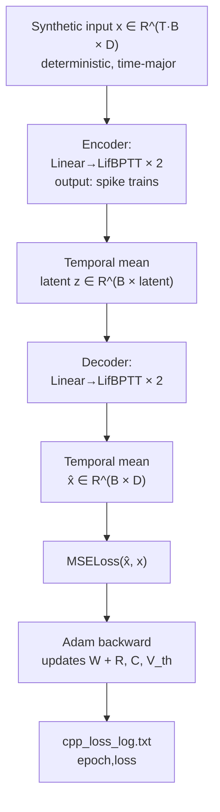

# Autoencoder LeakyReLU (Spiking Autoencoder)

Validates that a deep spiking autoencoder can be trained end-to-end in this C++ framework using `LifBPTT` with full BPTT and exponential surrogate gradients. Despite the filename containing "LeakyReLU", the demo uses **Leaky Integrate-and-Fire (LIF)** neurons — the name refers to the leaky dynamics, not the activation function. Input is synthetic deterministic data so failures are unambiguous.

---

## Theoretical Background

An autoencoder [Hinton & Salakhutdinov, 2006] learns an identity mapping through a bottleneck:

$$\hat{\mathbf{x}} = \text{Decoder}(\text{Encoder}(\mathbf{x})), \qquad \mathcal{L} = \|\mathbf{x} - \hat{\mathbf{x}}\|^2$$

In a spiking autoencoder, both encoder and decoder layers are LIF neurons. The latent code is the temporal mean of spike outputs. Non-differentiability of the spike function is handled by the exponential surrogate gradient:

$$\frac{\partial S}{\partial V} \approx \frac{1}{\beta_s} e^{-|V - V_\text{th}| / \beta_s}$$

Full BPTT unrolls the recurrence $V[t] = \beta V[t-1] + I[t]$ through $T$ steps and accumulates gradients for $R$, $C$, and $V_\text{th}$.

---

## How It Is Implemented Here

**Source:** `src/demos/cppDemos/autoencoder_leakyrelu/`

```cpp
// autoencoder_leakyrelu/autoEncoderLeakyReLUAndSpikeTest.cpp (structure)
// Architecture (input_dim → latent → input_dim):
//   Linear(D → hidden) → LifBPTT(T, R=1, C=1, V_th=1)
//   Linear(hidden → latent) → LifBPTT(T)
//   Linear(latent → hidden) → LifBPTT(T)
//   Linear(hidden → D) → LifBPTT(T)
//
// Loss: MSELoss on spike means vs. input
// Optimizer: Adam with weight_decay
// Logging: csv "cpp_loss_log.txt" (epoch, loss)
```

Weight initialisation: Kaiming (He) for all Linear layers before training.

---

## Data Flow



---

## How to Build and Run

```bash
cd /home/ensismoebius/Repos/doutorado/software/nn
cmake --preset=max-performance
cmake --build out/build/max-performance --target autoencoder_leakyrelu -j$(nproc)
./out/build/max-performance/src/demos/cppDemos/autoencoder_leakyrelu/autoencoder_leakyrelu
```

**Expected output:** per-epoch loss printed to console + `cpp_loss_log.txt` in working directory. Loss should decrease monotonically over the first 20–50 epochs.

---

## Test Suite

The LifBPTT BPTT correctness is tested by `core_gtest`:

```bash
cmake --build out/build/max-performance --target core_gtest -j$(nproc)
ctest --test-dir out/build/max-performance -R LifBPTT --output-on-failure
```

---

## Common Pitfalls

1. **LIF learning rate scale**: biophysical parameters ($R$, $C$, $V_\text{th}$) need a ~10× smaller lr than Linear weights. Without `Optimizer::attach_with_scales()`, the optimizer may drive $R$ or $C$ into the clamp region, freezing those parameters.
2. **Loss plateau near zero**: once spikes saturate (every neuron fires every step), MSE on spike means converges to a constant. Reduce `voltage_threshold` or add spike-rate regularisation.
3. **`reset_state()` between epochs**: without resetting, membrane state from the end of epoch $n$ feeds into epoch $n+1$, causing non-reproducible training dynamics.

---

## See Also

- [Concepts/Membrane-Dynamics](../Concepts/Membrane-Dynamics.md) — LIF RC circuit
- [Concepts/Time-Major-Layout](../Concepts/Time-Major-Layout.md) — input shape contract
- [Concepts/SNN-and-Surrogate-Gradients](../Concepts/SNN-and-Surrogate-Gradients.md) — BPTT for SNNs
- [Concepts/Autoencoders](../Concepts/Autoencoders.md) — autoencoder theory

---

## References

[1] G. E. Hinton and R. R. Salakhutdinov, "Reducing the dimensionality of data with neural networks," *Science*, vol. 313, pp. 504–507, 2006.

[2] W. Fang et al., "Incorporating Learnable Membrane Time Constants to Enhance Learning of Spiking Neural Networks," in *Proc. IEEE/CVF ICCV*, 2021, pp. 2661–2671.

[3] P. J. Werbos, "Backpropagation through time: what it does and how to do it," *Proceedings of the IEEE*, vol. 78, no. 10, pp. 1550–1560, 1990.
