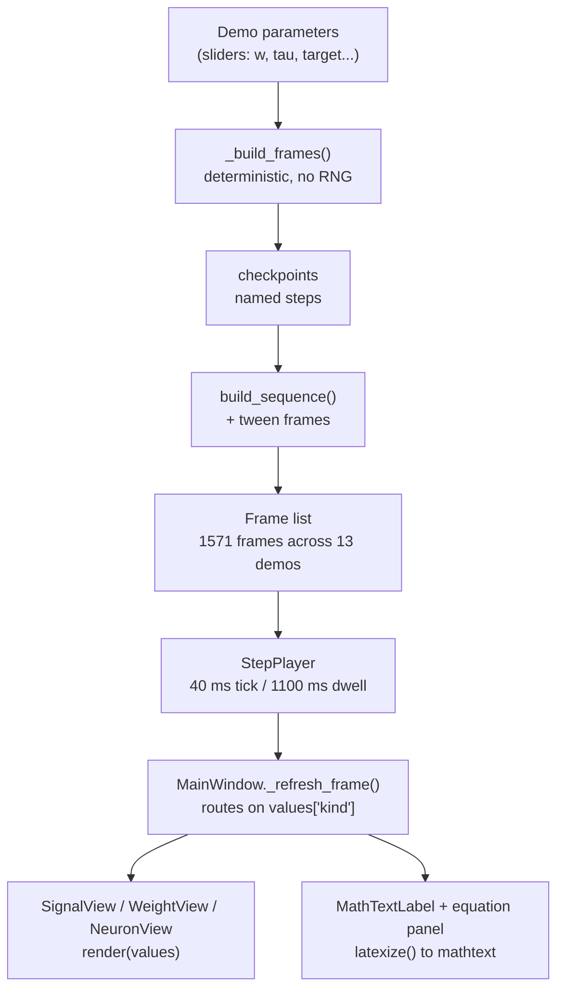

# Efficient Neural Networks Lab

A standalone PySide6 + matplotlib desktop application (`software/efficient_nn_lab/`) that
animates BitNet quantization and spiking-neural-network mechanics, one step at a time, for a
one-hour undergraduate lecture. It is **not** part of the C++ `nn` library and shares no code
with it — it is the live companion to the LaTeX deck in
`documentation/08-lectures/fronteiras-bitnets-redes-pulso/`, opened on stage at the moment the
matching slide is on screen. 13 demos, 1571 precomputed frames, zero randomness at playback
time.

## The problem it solves

A slide can show you that the Straight-Through Estimator "pretends the quantizer was the
identity". It cannot show you the moment the real derivative goes to zero and the substitute
does not, on the same weight, with the same numbers, while a student asks "wait, which
derivative are we replacing?".

Concretely: the deck's `bitnetCamada.tex` prints `w = [0,6, −0,3, 0,05]`, `γ = 0,3056`, and the
result `[1, −1, 0]`. A student who does not already believe the middle weight vanishes has
nothing to inspect — the arrow from input to output is one static line of LaTeX. In the lab,
that same weight is a slider: drag it toward zero and watch the marker fall into the dead zone
and the output flip to `0`, live.

That is the whole design brief. Every demo answers **exactly one question**, with numbers the
audience can check against the slide they just saw.

## Theoretical Background

Two independent research lines converged on the same trick, and the lab exists to make that
convergence visible.

**Ternary weight quantization.** BitNet replaces the dense floating-point matrix multiply of a
Transformer with 1-bit weights [Wang, 2023]; BitNet b1.58 extends this to ternary weights
`{−1, 0, +1}`, reporting parity with an FP16 LLaMA baseline from roughly 3B parameters upward
[Ma, 2024]. The name is $\log_2(3) \approx 1{,}58$ bits per weight. The obstacle is that the
quantizer $Q(w)$ is a step function: its derivative is zero almost everywhere and undefined at
the steps, so gradient descent has nothing to propagate.

**The Straight-Through Estimator (STE).** The standard answer is to use the true step function
in the forward pass and substitute a smooth surrogate — in the simplest case the identity,
$\partial Q/\partial w := 1$ — in the backward pass [Bengio, 2013]. The gradient that arrives
at the quantizer is passed to the real-valued weight unchanged.

**Surrogate gradients in SNNs.** Spiking networks hit an identical wall: the spike function
$S(v) = \mathbb{1}[v \geq v_{th}]$ is a Heaviside step, so $dS/dv$ is zero almost everywhere.
The field's answer is the same shape of answer — real step forward, smooth differentiable
surrogate backward [Neftci, 2019]. The lab's `Comparação` demo puts the two side by side
precisely so the analogy is stated and then immediately qualified: *analogous, not identical*.

**Why step-by-step and learner-paced, not a movie.** The evidence for animation over static
graphics is weaker than intuition suggests: reviewing the literature, [Tversky, 2002] found
that apparent advantages of animation usually dissolve under scrutiny into a confound — the
animated version conveyed *more information*, or added *interactivity*, rather than the motion
itself helping. The two conditions that survive that critique are exactly the ones this
application is built around: the learner controls the pace (Reset / Step / Play / Pause, and
arrow keys), and the animated version carries the same content as the static slide rather than
extra content. This is why `Play` dwells 1,1 s on each checkpoint instead of running smoothly,
and why every demo is restricted to one question.

## How It Is Implemented Here

Everything is precomputed. A demo turns its current parameters into a deterministic list of
`Frame`s once; playback only moves an index into that list.

```python
# software/efficient_nn_lab/src/efficient_nn_lab/core/demo.py
@dataclass
class Frame:
    label: str
    values: dict[str, object] = field(default_factory=dict)
    explanation: str = ""
    equation: str = ""
    is_checkpoint: bool = True
```

Two kinds of frame make up a sequence. **Checkpoints** are the didactically named steps that
"Passo 3/9" counts and that Anterior/Próximo jump between. **Tweens** are interpolated frames
generated between consecutive checkpoints, so a single click plays a short motion instead of a
jump cut. `build_sequence` interleaves them; `tween_values` blends the two `values` dicts,
easing floats and same-shape NumPy arrays element-wise and snapping anything it cannot
interpolate (labels, stage tags).

Per-cell reveal arrays are what let one matrix fill in one entry at a time:

```python
# software/efficient_nn_lab/src/efficient_nn_lab/core/math_utils.py
def _tween_leaf(va, vb, eased, raw_t):
    if isinstance(va, (int, float)) and isinstance(vb, (int, float)):
        return lerp(float(va), float(vb), eased)
    if isinstance(va, np.ndarray) and isinstance(vb, np.ndarray) and va.shape == vb.shape:
        return va + (vb - va) * eased
    return vb if raw_t >= 1.0 else va      # text must not "melt" between two strings
```

`DemoModule` (framework-agnostic, unit-testable, no Qt import) owns the frame list and
navigation. `StepPlayer` owns the only `QTimer`. `MainWindow` is the single place that knows
how a demo maps onto a widget, routed by the `kind` tag every frame carries.

### Structure

```
MainWindow ── tree (13 demos) ── ControlsWidget ── signals only, no demo access
     │
     ├── StepPlayer  (the only QTimer: 40 ms tick, 1100 ms dwell at checkpoints)
     │        └── DemoModule ── [Frame, Frame, ...]   precomputed, deterministic
     │
     └── QStackedWidget
              ├── SignalView   spikes, membrane traces, Poisson images
              ├── WeightView   number lines, quantization staircase, surrogate curves
              └── NeuronView   block diagrams, matrices, comparison tables
```

## Data Flow



## Usage Example

```bash
# software/efficient_nn_lab/
./run.sh                          # opens on the welcome screen
./run.sh --demo snn.lif           # deep-link straight to one demo (slug)
python -m pytest -q               # 297 tests
```

The deck's PDF links call the same entry point, so a `run:` link on a slide opens the lab on
the matching demo:

```bash
# documentation/08-lectures/fronteiras-bitnets-redes-pulso/abrir-demo.sh
exec ./run.sh --demo "$1" &
```

Adding a demo is one class plus one registration; the widgets need no per-demo special-casing
as long as the frames carry a `kind` the router already knows:

```python
# a minimal DemoModule
class MyDemo(DemoModule):
    title = "SNN -> Minha demo"     # mirrors the slide title (ESPECIFICACAO_DLVL.md #42)
    slug = "snn.mine"               # stable deep-link id, never renamed
    description = "Uma pergunta única."

    def _build_frames(self) -> list[Frame]:
        return build_sequence([
            Frame("Passo 1", {"kind": "signal_spikes", ...}, "O que acontece aqui."),
            Frame("Passo 2", {"kind": "signal_spikes", ...}, "E aqui."),
        ])
```

## The 13 demos

Each answers one question (`ESPECIFICACAO_DLVL.md` #5). "Passos" counts checkpoints, not frames.

| Slug | Demo | Single question | Passos |
|---|---|---|---|
| `backprop.classic` | Forward e backward clássicos | Como forward/backward funcionam sem quantização, e o exemplo converge? | 70 |
| `backprop.mlp` | Rede de 4 camadas | Como isso escala para uma rede real (3→2→2→1), um neurônio de cada vez? | 13 |
| `backprop.matrix` | A rede como matrizes | Em que sentido a rede é *só* multiplicação de matrizes — inclusive o backward? | 46 |
| `bitnet.quant` | Quantização | O que significa quantizar um peso? | 2 |
| `bitnet.forward` | Forward | O que acontece no forward, e quão longe do alvo? | 9 |
| `bitnet.ste` | Backward → STE | Por que o backward é problemático, e como o STE resolve? | 7 |
| `bitnet.guided` | Exemplo guiado | O ciclo completo, do peso real ao BitNet, em 10 passos fixos | 10 |
| `snn.spikes` | Sinal e spikes | O que é um spike? | 4 |
| `snn.poisson` | Codificação Poisson | A informação pode estar na *probabilidade* de disparo? | 21 |
| `snn.poisson_image` | Codificação Poisson (imagem) | Como fica a esparsidade num caso real, pixel a pixel? | 30 |
| `snn.lif` | LIF | Como um neurônio LIF integra, dispara e reseta? | 13 |
| `snn.surrogate` | Surrogate gradient | Como se treina através de uma função em degrau? | 5 |
| `comparison` | ANN × BitNet × SNN | Em que os três diferem? | 8 |

`snn.poisson_image` is the only demo that offers **Loop rápido** — continuous, dwell-free
playback that wraps at the end (~1,2 s per lap versus ~33 s for a normal `Play` pass). It earns
the exception because there the *cadence is the content*: one Poisson time-step is
indistinguishable from noise, and the picture only emerges once frames go by fast enough for
the eye to integrate them.

### Moving between demos on stage

`Modo palestra` hides the sidebar tree to strip the window down for projection — and the tree
was the only way to change demo, so the mode built for presenting was the one mode you could
not advance in without leaving it. **Próxima demo ▸** (shortcut `N`) is that navigation: next
item in the current section, first item of the next section once a section runs out, wrapping
around at the end of the deck. The order is derived from the same dict that builds the tree
(`_demo_order`), and the tree's highlight follows along, so leaving lecture mode never reveals
a sidebar pointing somewhere else. `N` rather than `→`/`PageDown`: `→` already means "next step
*inside* this demo", and presenter remotes send `PageDown` to advance the slides.

### Why the comparison table sizes itself

`comparison` is the only all-text demo, and the only one whose type size is computed rather
than written down. The Qt matplotlib canvas keeps its dpi fixed and grows the figure's
*inches*, so a hard-coded `fontsize=8` that looked fine on a 900×400 canvas becomes 8 pt inside
a ~1000 pt-tall figure once the app is projected — it shrinks relatively, exactly when
legibility matters most. `NeuronView._cmp_geometry` takes the smaller of what the height allows
(every line of text plus its gaps) and what one column's width allows (a cell wrapped to at
most two lines), then spends the leftover height on the gaps so the table fills its box.
Measured at the app's real canvas: ~22 pt per cell, about 3× the old fixed size.

## Common Pitfalls

- **Assuming the quantization matches BitNet b1.58.** It does not, deliberately. The lab uses a
  fixed symmetric threshold; real b1.58 uses an absmean scale $\gamma = \mathrm{mean}(|W|)$ per
  tensor. This is a documented didactic simplification (`README.md`, "Precisão científica") —
  the *slide* teaches the real absmean rule, so the presenter must say the difference out loud
  when switching to the software. **Silent failure**: nobody notices, and the audience leaves
  believing BitNet thresholds are fixed.
- **Adding randomness to a demo.** Frames must be reproducible run to run
  (`ESPECIFICACAO_DLVL.md` #35): the same slider position must give the same picture in
  rehearsal and on stage. Poisson demos precompute their draws once, seeded. **Loud failure**
  if you break it — `test_reset_is_deterministic` fails.
- **Letting a frame reveal two new values at once.** In the step-by-step demos this is the
  tempting shortcut ("show both neurons of the layer"), and it is exactly what makes a viewer
  lose the thread: two numbers appear and only one was explained.
  `test_matrix_demo_reveals_at_most_one_new_value_per_step` enforces one per step.
- **Trusting "an image came back" as proof an equation rendered.** `render_math_image` falls
  back to drawing the raw string when mathtext rejects the translation, so a broken equation
  still produces a picture — of pseudo-LaTeX source. Four equations shipped that way before
  `test_every_demo_equation_is_really_parsed_as_math` asserted the parse itself. **Silent
  failure** by construction; the fallback now also warns on stderr.
- **Renaming a `slug`.** Titles may be reworded; slugs are baked into the PDF's `run:` links.
  A rename breaks the deck silently — the link opens the app on the welcome screen instead.

## See Also

- [Demos Overview](./Overview.md) — the C++ and Python demos of the `nn` library proper
- [SNN and Surrogate Gradients](../Concepts/SNN-and-Surrogate-Gradients.md) — the same
  backward-pass substitution, in the framework this wiki documents
- [Straight-Through Estimator](../Concepts/Straight-Through-Estimator.md) — the BitNet side of
  that analogy, and where it stops being an analogy
- [Spike Encoding](../Concepts/Spike-Encoding.md) — rate vs. latency coding, animated by
  `snn.poisson` and `snn.poisson_image`
- [Membrane Dynamics](../Concepts/Membrane-Dynamics.md) — the LIF model that `snn.lif` steps through
- `software/efficient_nn_lab/README.md` — install, run, per-demo table, negative scope
- `documentation/08-lectures/fronteiras-bitnets-redes-pulso/presentation.md` — the slide ↔ demo
  mapping table, one row per slide

## References

[67] H. Wang, S. Ma, L. Dong, S. Huang, H. Wang, L. Ma, F. Yang, R. Wang, Y. Wu, and F. Wei, "BitNet: Scaling 1-bit transformers for large language models," *arXiv:2310.11453*, 2023. [Online]. Available: https://arxiv.org/abs/2310.11453

[68] S. Ma, H. Wang, L. Ma, L. Wang, W. Wang, S. Huang, L. Dong, R. Wang, J. Xue, and F. Wei, "The era of 1-bit LLMs: All large language models are in 1.58 bits," *arXiv:2402.17764*, 2024. [Online]. Available: https://arxiv.org/abs/2402.17764

[69] Y. Bengio, N. Léonard, and A. Courville, "Estimating or propagating gradients through stochastic neurons for conditional computation," *arXiv:1308.3432*, 2013. [Online]. Available: https://arxiv.org/abs/1308.3432

[70] B. Tversky, J. B. Morrison, and M. Bétrancourt, "Animation: can it facilitate?," *Int. J. Human-Computer Studies*, vol. 57, no. 4, pp. 247–262, Oct. 2002. [Online]. Available: https://doi.org/10.1006/ijhc.2002.1017

[7] E. O. Neftci, H. Mostafa, and F. Zenke, "Surrogate gradient learning in spiking neural networks," *IEEE Signal Process. Mag.*, vol. 36, no. 6, pp. 51–63, Nov. 2019. [Online]. Available: https://arxiv.org/abs/1901.09948
