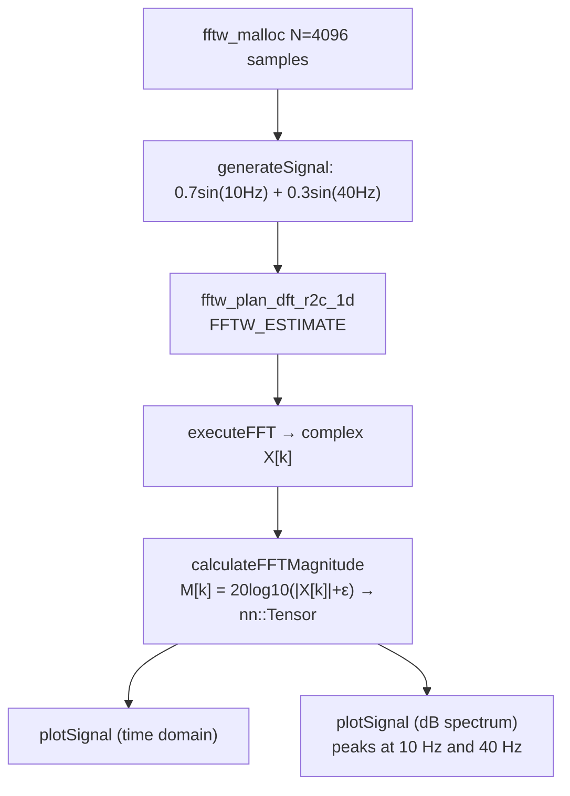

# FFT Demo

A minimal sanity-check demo that generates a synthetic two-component sinusoidal signal, computes its real-to-complex DFT via FFTW3, converts spectral magnitudes to decibels, and plots both the time-domain waveform and frequency-domain spectrum using matplotlib-cpp. Its primary purpose is to verify that FFTW3 and matplotlib-cpp are correctly linked and functional.

---

## Theoretical Background

The Cooley-Tukey FFT algorithm [Cooley & Tukey, 1965] reduces the DFT from $O(N^2)$ to $O(N \log N)$ by recursive decomposition. The one-sided real-to-complex transform for a real signal $x[n]$ of length $N$ is:

$$X[k] = \sum_{n=0}^{N-1} x[n]\, e^{-j 2\pi k n / N}, \quad k = 0, \ldots, \lfloor N/2 \rfloor$$

FFTW3 [Frigo & Johnson, 2005] auto-tunes the decomposition plan at runtime to achieve near-optimal performance on the target hardware. Magnitude in dB:

$$M[k] = 20 \log_{10}\!\left(\sqrt{\text{Re}(X[k])^2 + \text{Im}(X[k])^2} + \varepsilon\right), \quad \varepsilon = 10^{-300}$$

---

## How It Is Implemented Here

**Source:** `src/demos/cppDemos/fft_demo/`

Signal parameters (compile-time constants): $f_s = 1024\,\text{Hz}$, $f_1 = 10\,\text{Hz}$, $f_2 = 40\,\text{Hz}$, $T = 4\,\text{s}$, $N = 4096$ samples.

```cpp
// src/demos/cppDemos/fft_demo/fft_demo.cpp (structure)
// 1. Allocate FFTW-aligned buffer via fftw_malloc
// 2. Fill with: 0.7*sin(2π*10*n/1024) + 0.3*sin(2π*40*n/1024)
// 3. Plan and execute FFTW r2c (FFTW_ESTIMATE)
// 4. Compute M[k] = 20*log10(|X[k]| + eps) → nn::Tensor
// 5. plotSignal(time_axis, signal) — matplotlib-cpp
// 6. plotSignal(freq_axis, M)      — matplotlib-cpp (blocking show)
```

Key component: `FFTWFreeDeleter` — RAII deleter for `fftw_malloc` blocks.

---

## Data Flow



---

## How to Build and Run

```bash
cd /home/ensismoebius/Repos/doutorado/software/nn
cmake --preset=max-performance
cmake --build out/build/max-performance --target fftw3_demo -j$(nproc)
./out/build/max-performance/src/demos/cppDemos/fft_demo/fftw3_demo
```

No arguments. Two matplotlib windows appear sequentially; closing the second terminates the process.

**Expected output:** two plot windows — time-domain waveform and dB spectrum with peaks at 10 Hz and 40 Hz.

---

## Test Suite

No dedicated unit tests for this demo (it is a visual sanity check). The FFTW integration is implicitly tested by the `waveCoreLib` tests that use RFFT internally, and by the `lfcc_pipeline_gtest` tests:

```bash
cmake --build out/build/max-performance --target lfcc_pipeline_gtest -j$(nproc)
ctest --test-dir out/build/max-performance -R lfcc_pipeline --output-on-failure
```

---

## Common Pitfalls

1. **`fftw_malloc` vs `new`**: FFTW requires aligned memory from `fftw_malloc`; using `new` may cause segfaults on SIMD-optimised plans. Always use `fftw_malloc`/`fftw_free`.
2. **One-sided spectrum length**: the output buffer for a length-$N$ r2c transform has $\lfloor N/2 \rfloor + 1$ complex elements, not $N$. Iterating to $N$ reads garbage.
3. **matplotlib-cpp requires Python**: if Python or matplotlib is not in `PATH`, the plot calls will throw at runtime even if the binary compiled successfully.

---

## See Also

- [Demos/lfcc-feature-demo](./lfcc-feature-demo.md) — uses RFFT as inner kernel of LFCC pipeline
- [Core/Wave](../Core/Wave.md) — WAV I/O and audio utilities
- [Concepts/LFCC](../Concepts/LFCC.md) — LFCC theory (FFT-based feature extraction)

---

## References

[1] J. W. Cooley and J. W. Tukey, "An algorithm for the machine calculation of complex Fourier series," *Mathematics of Computation*, vol. 19, pp. 297–301, Apr. 1965.

[2] M. Frigo and S. G. Johnson, "The design and implementation of FFTW3," *Proceedings of the IEEE*, vol. 93, no. 2, pp. 216–231, 2005.
