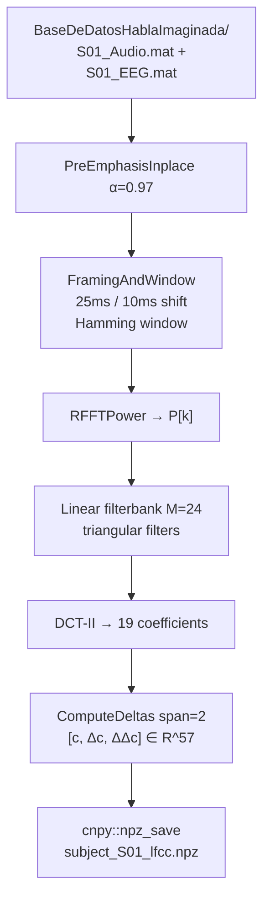

# LFCC Feature Demo

Batch LFCC (Linear Frequency Cepstral Coefficient) feature-extraction pipeline that walks the *BaseDeDatosHablaImaginada* corpus, pairs per-subject Audio and EEG MAT files, and produces 57-dimensional LFCC feature matrices stored as NumPy `.npz` archives. This is the upstream feature stage for downstream SNN/ResNet classifiers.

---

## Theoretical Background

LFCCs are a variant of MFCCs [Davis & Mermelstein, 1980] using a uniform linear filter spacing instead of the mel scale. The pipeline follows the standard cepstral frontend:

**Pre-emphasis** (high-pass, $\alpha = 0.97$):
$$y[n] = x[n] - 0.97\,x[n-1]$$

**Framing + Hamming window**: 25 ms frames, 10 ms shift.

**Linear filterbank** ($M = 24$ triangular filters uniformly spaced on the linear axis, not mel):
$$E_m = \sum_k H_m[k]\, P[k]$$

**DCT-II** (19 coefficients, DC discarded):
$$c_n = \sqrt{\frac{2}{M}} \sum_{m=0}^{M-1} E_m \cos\!\left(\pi n (m + 0.5) / M\right)$$

**Delta features** [Furui, 1986]: velocity ($\Delta$) and acceleration ($\Delta\Delta$) cepstra via regression window $\delta = 2$. Final feature vector: $[\mathbf{c}, \boldsymbol{\Delta}, \boldsymbol{\Delta\Delta}] \in \mathbb{R}^{57}$.

---

## How It Is Implemented Here

**Source:** `src/demos/cppDemos/lfcc_feature_demo/`  
**Library:** `waveCoreLib` (project internal)

```cpp
// src/demos/cppDemos/lfcc_feature_demo/lfcc_pipeline.cpp (structure)
for (auto& entry : std::filesystem::directory_iterator(dataset_dir)) {
    // Pair _Audio.mat + _EEG.mat files per subject
    process_subject(audio_path, eeg_path, subject_id);
    // → cnpy::npz_save("subject_<id>_lfcc.npz", ...)
}

// lfcc_pipeline_utils.hpp stages:
// 1. PreEmphasisInplace(signal, alpha=0.97)
// 2. FramingAndWindow(signal, frame_len=400, shift=160) → Hamming
// 3. RFFTPower(frame) → P[k]
// 4. BuildLinearFilterbank(M=24, fft_size, fs)
// 5. DotPowerFilterbank(P, H) → E_m
// 6. DCT2(E, n_ceps=19) → c
// 7. ComputeDeltas(c, delta=2) → [c, Δc, ΔΔc]
```

---

## Data Flow



---

## How to Build and Run

```bash
cd /home/ensismoebius/Repos/doutorado/software/nn
cmake --preset=max-performance
cmake --build out/build/max-performance --target exec_lfcc_pipeline -j$(nproc)
./out/build/max-performance/src/demos/cppDemos/lfcc_feature_demo/exec_lfcc_pipeline
```

The binary expects `BaseDeDatosHablaImaginada/` relative to the working directory. Place the dataset there or adjust the path constant in `lfcc_pipeline.cpp`.

**Expected output:** one `subject_S<id>_lfcc.npz` per subject with keys:
- `lfcc_features`: shape `(F, 57)` float32
- `eeg_windows`: shape `(F, C, W)` float32

---

## Test Suite

```bash
cmake --build out/build/max-performance --target lfcc_pipeline_utils_gtest -j$(nproc)
ctest --test-dir out/build/max-performance -R LfccPipelineUtilsTest --output-on-failure
```

Tests in `src/demos/cppDemos/lfcc_feature_demo/tests/lfcc_pipeline_utils_gtest.cpp` cover each stage independently: `PreEmphasisInplace`, `FramingAndWindow`, `RFFTPower`, `BuildLinearFilterbank`, `DotPowerFilterbank`, `DCT2`, `ComputeDeltas`.

---

## Common Pitfalls

1. **Dataset path**: the path to `BaseDeDatosHablaImaginada/` is a compile-time or runtime constant in `lfcc_pipeline.cpp`. Running from a different working directory will cause the binary to exit without processing any subjects.
2. **Frame count mismatch**: EEG windows and audio frames are saved together for temporal alignment. If the EEG and audio files have different durations, the alignment breaks silently — check that both `.mat` files cover the same utterance.
3. **Single-precision DCT**: FFTW single-precision (`fftw3f`) is used here. If you link `fftw3` (double) instead, type mismatches will cause link errors.

---

## See Also

- [Concepts/LFCC](../Concepts/LFCC.md) — full LFCC theory and comparison with MFCC
- [Demos/snn-speaker-demo](./snn-speaker-demo.md) — uses LFCC features as input to SNN
- [Core/Wave](../Core/Wave.md) — audio processing utilities

---

## References

[1] S. Davis and P. Mermelstein, "Comparison of parametric representations for monosyllabic word recognition in continuously spoken sentences," *IEEE Trans. Acoust. Speech Signal Process.*, vol. 28, no. 4, pp. 357–366, Aug. 1980.

[2] S. Furui, "Speaker-independent isolated word recognition based on emphasized spectral dynamics," in *Proc. ICASSP*, 1986, pp. 1991–1994.
