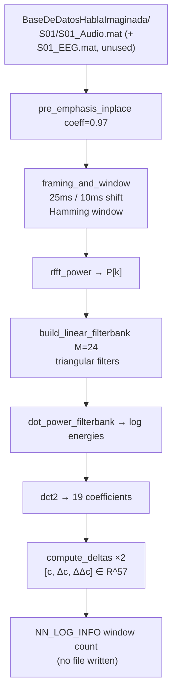

# LFCC Feature Demo

Batch LFCC (Linear Frequency Cepstral Coefficient) feature-extraction pipeline that walks the *BaseDeDatosHablaImaginada* corpus, pairs per-subject Audio and EEG MAT files, and runs the 57-dimensional LFCC extraction (cepstra + Δ + ΔΔ) over each subject's audio. As currently implemented the demo only logs per-subject window counts — it does not persist `.npz` archives or process the EEG side. This is the upstream feature stage for downstream SNN/ResNet classifiers (which read their own MAT/NPZ inputs directly, not this demo's output).

---

## Theoretical Background

LFCCs are a variant of MFCCs [Davis & Mermelstein, 1980] using a uniform linear filter spacing instead of the mel scale. The pipeline follows the standard cepstral frontend:

**Pre-emphasis** (high-pass, $\alpha = 0.97$):
$$y[n] = x[n] - 0.97\,x[n-1]$$

**Framing + Hamming window**: 25 ms frames, 10 ms shift.

**Linear filterbank** ($M = 24$ triangular filters uniformly spaced on the linear axis, not mel):
$$E_m = \sum_k H_m[k]\, P[k]$$

**DCT-II** (19 coefficients, DC discarded):
$$c_n = \sqrt{\frac{2}{M}} \sum_{m=0}^{M-1} E_m \cos\!\left(\pi n (m + 0.5) / M\right)$$

**Delta features** [Furui, 1986]: velocity ($\Delta$) and acceleration ($\Delta\Delta$) cepstra via regression window $\delta = 2$. Final feature vector: $[\mathbf{c}, \boldsymbol{\Delta}, \boldsymbol{\Delta\Delta}] \in \mathbb{R}^{57}$.

---

## How It Is Implemented Here

**Source:** `src/demos/cppDemos/lfcc_feature_demo/`  
**Library:** `waveCoreLib` (project internal)

```cpp
// src/demos/cppDemos/lfcc_feature_demo/lfcc_pipeline.cpp (structure)
for (auto& entry : std::filesystem::directory_iterator(base_path)) {
    // entry.is_directory(): pair <subject>_Audio.mat + <subject>_EEG.mat
    // inside that subject's own subdirectory
    if (audio and eeg files both exist)
        process_subject(SubjectInfo{path, name, audio_file_path, eeg_file_path});
}

// process_subject() (src/core/wave/lfcc_pipeline_utils.cpp) calls
// load_and_process_audio(), which runs the nn::core::wave:: pipeline
// (declared in include/wave/audioFeatureExtraction.hpp):
// 1. pre_emphasis_inplace(signal, coeff=0.97)
// 2. framing_and_window(signal, framing_context) → Hamming, 25ms/10ms
// 3. rfft_power(frames, frame_length) → P[k]
// 4. build_linear_filterbank(frame_length, filterbank_context) (M=24)
// 5. dot_power_filterbank(P, filterbank_context) → log energies
// 6. dct2(log_energies, loading_params) → 19 cepstral coefficients
// 7. compute_deltas(cepstral_coeff, ...) → Δc, then again on Δc → ΔΔc
//
// process_subject() only logs the audio-window count (NN_LOG_INFO) — it does
// NOT write an .npz file and does NOT process the EEG side of SubjectInfo.
```

---

## Data Flow



---

## How to Build and Run

```bash
cd /home/ensismoebius/Repos/doutorado/software/nn
cmake --preset=max-performance
cmake --build out/build/max-performance --target exec_lfcc_pipeline -j$(nproc)
./out/build/max-performance/src/demos/cppDemos/lfcc_feature_demo/exec_lfcc_pipeline
```

The binary reads a **hardcoded absolute path** in `main()`:
`/home/ensismoebius/Documentos/UNESP/doutorado/databases/BaseDeDatosHablaImaginada/`.
There is no CLI argument or relative-path fallback — edit the string literal in
`lfcc_pipeline.cpp` to point at your own dataset copy.

**Expected output:** `NN_LOG_INFO` lines reporting the audio-window count per
subject. As of the current `process_subject()` implementation, **no `.npz` file
is written** and the EEG side of each subject pair is loaded into `SubjectInfo`
but never processed — this is a feature-extraction *pipeline demo*, not yet a
persisted-dataset builder.

---

## Test Suite

```bash
cmake --build out/build/max-performance --target lfcc_pipeline_utils_gtest -j$(nproc)
ctest --test-dir out/build/max-performance -R LfccPipelineUtilsTest --output-on-failure
```

Tests in `src/demos/cppDemos/lfcc_feature_demo/tests/lfcc_pipeline_utils_gtest.cpp` cover each `nn::core::wave::` stage independently: `pre_emphasis_inplace`, `framing_and_window`, `rfft_power`, `build_linear_filterbank`, `dot_power_filterbank`, `dct2`, `compute_deltas` (declared in `include/wave/audioFeatureExtraction.hpp`).

---

## Common Pitfalls

1. **Dataset path is hardcoded**: `base_path` in `main()` is a literal absolute path on the original author's machine. Running on another machine (or a different dataset location) silently iterates an empty/nonexistent directory and processes zero subjects — edit the literal, there is no env var or CLI flag.
2. **EEG is loaded but not processed**: `SubjectInfo` carries `eeg_file_path`, and both `_Audio.mat`/`_EEG.mat` must exist for a subject directory to be picked up, but `process_subject()` only calls `load_and_process_audio()` on the audio side. Do not assume EEG alignment is validated here.
3. **Single-precision DCT**: FFTW single-precision (`FFTW::FFTWF`) is linked here. If you link `fftw3` (double) instead, type mismatches will cause link errors.

---

## See Also

- [Concepts/LFCC](../Concepts/LFCC.md) — full LFCC theory and comparison with MFCC
- [Demos/snn-speaker-demo](./snn-speaker-demo.md) — uses LFCC features as input to SNN
- [Core/Wave](../Core/Wave.md) — audio processing utilities

---

## References

[1] S. Davis and P. Mermelstein, "Comparison of parametric representations for monosyllabic word recognition in continuously spoken sentences," *IEEE Trans. Acoust. Speech Signal Process.*, vol. 28, no. 4, pp. 357–366, Aug. 1980.

[2] S. Furui, "Speaker-independent isolated word recognition based on emphasized spectral dynamics," in *Proc. ICASSP*, 1986, pp. 1991–1994.
