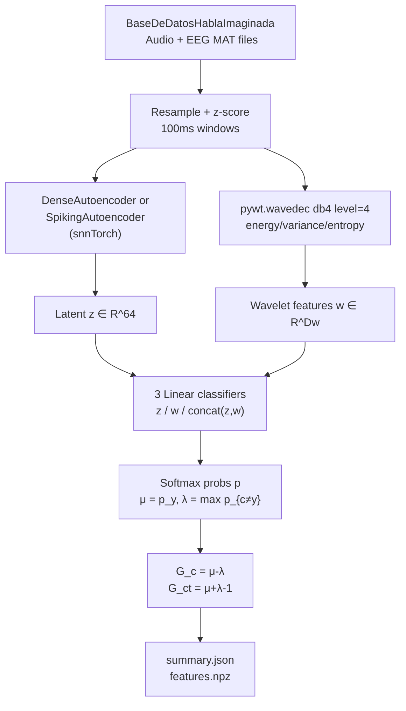

# Multimodal EEG + Audio Demo

Python prototype for multimodal EEG and audio fusion using autoencoders and paraconsistent analysis. Loads the *BaseDeDatosHablaImaginada* corpus, trains a dense or spiking autoencoder to compress each modality to a shared latent space, extracts complementary DWT statistics, and evaluates three linear classifiers under the Da Costa paraconsistent logic framework. Generates a JSON summary and NPZ feature archive.

---

## Theoretical Background

Multimodal fusion of EEG and audio for imagined speech is an open problem [Palazzo et al., 2020]. A joint autoencoder learns a shared latent manifold that separates speaker-specific patterns from session noise.

Paraconsistent analysis [Da Costa, 1974] applies after classification. Given class probability vector $\mathbf{p}$ and true label $y$:

$$\mu = p_y \quad (\text{belief in correct class}), \quad \lambda = \max_{c \neq y} p_c \quad (\text{belief in competing class})$$

$$G_c = \mu - \lambda \quad (\text{certainty degree}), \qquad G_{ct} = \mu + \lambda - 1 \quad (\text{contradiction degree})$$

High $G_c > 0$ with low $|G_{ct}|$ = confident and consistent. High $|G_{ct}|$ = model supports two competing hypotheses simultaneously — a paraconsistent state. This metric is novel to this thesis.

DWT statistics (energy, variance, entropy) follow Vetterli & Kovacevic (1995) as speaker-discriminative features.

---

## How It Is Implemented Here

**Source:** `src/demos/pyDemos/multimodal_eeg_audio/`

```python
# run_prototype.py pipeline
# 1. Preprocess: resample_poly audio→16kHz, EEG→200Hz; z-score; 100ms windows
# 2. DenseAutoencoder or SpikingAutoencoder (snnTorch Leaky, learn_beta=True)
# 3. Train on MSE; extract z ∈ R^64 per window
# 4. pywt.wavedec(signal, 'db4', level=4) → energy/variance/entropy → w ∈ R^D_w
# 5. Three linear classifiers: z, w, [z,w]
# 6. Paraconsistent: μ/λ from softmax → G_c, G_ct per sample → aggregate stats
# 7. Write summary.json + features.npz
```

---

## Data Flow



---

## How to Build and Run

```bash
pip install torch torchaudio snntorch pywavelets scipy numpy

python src/demos/pyDemos/multimodal_eeg_audio/run_prototype.py \
    --data-root /path/to/BaseDeDatosHablaImaginada \
    --output-dir results/multimodal_prototype \
    --epochs 20 \
    --batch-size 32 \
    --device cuda
```

**Key options:** `--data-root`, `--epochs`, `--batch-size`, `--device`, `--seed`, `--lr`, `--weight-decay`, `--no-save-features`.

**Expected output:**
```
results/multimodal_prototype/
  summary.json       — accuracy + G_c/G_ct per classifier
  features.npz       — z_latent, w_wavelet, labels, speaker_ids
  training_curve.csv — epoch vs reconstruction loss
```

---

## Test Suite

This is a Python prototype; no formal test binary. Smoke-test with a small dataset:

```bash
python src/demos/pyDemos/multimodal_eeg_audio/run_prototype.py \
    --data-root /path/to/data --epochs 2 --batch-size 8
```

Check `summary.json` for non-NaN accuracy values.

---

## Common Pitfalls

1. **Native sample rate mismatch**: the demo assumes audio is at 44100 Hz and EEG at 256 Hz. If your corpus has different rates, pass `--audio-orig-sr` and `--eeg-orig-sr` or `resample_poly` will produce wrong alignments.
2. **SpikingAutoencoder and short sequences**: the spiking variant uses `snn_time_steps=5` by default. For 100 ms windows at 16 kHz, each window has 1600 samples; this is much longer than 5 spike steps. The temporal mean compresses T=5 spike outputs into the latent, so the SNN does not actually process all 1600 samples per step — only a downsampled version.
3. **CUDA out of memory**: the full dataset with `batch_size=64` may exceed GPU memory for large corpora. Reduce `--batch-size` or use `--device cpu`.

---

## See Also

- [Core/Paraconsistent](../Core/Paraconsistent.md) — Da Costa framework implementation
- [Concepts/Imagined-Speech-and-EEG](../Concepts/Imagined-Speech-and-EEG.md) — EEG imagined speech background
- [Concepts/Autoencoders](../Concepts/Autoencoders.md) — autoencoder theory
- [Experiments/Experiment05](../Experiments/Experiment05.md) — thesis primary experiment using paraconsistent ranking

---

## References

[1] N. C. A. Da Costa, "On the theory of inconsistent formal systems," *Notre Dame J. Formal Logic*, vol. 15, pp. 497–510, 1974.

[2] S. Palazzo, C. Spampinato, I. Kavasidis, D. Giordano, J. Schmidt, and M. Shah, "Decoding brain representations by multimodal learning of neural activity and visual features," *IEEE Trans. Pattern Anal. Mach. Intell.*, vol. 43, pp. 3833–3849, 2020.

[3] M. Vetterli and J. Kovacevic, *Wavelets and Subband Coding*. Englewood Cliffs, NJ: Prentice Hall, 1995.
