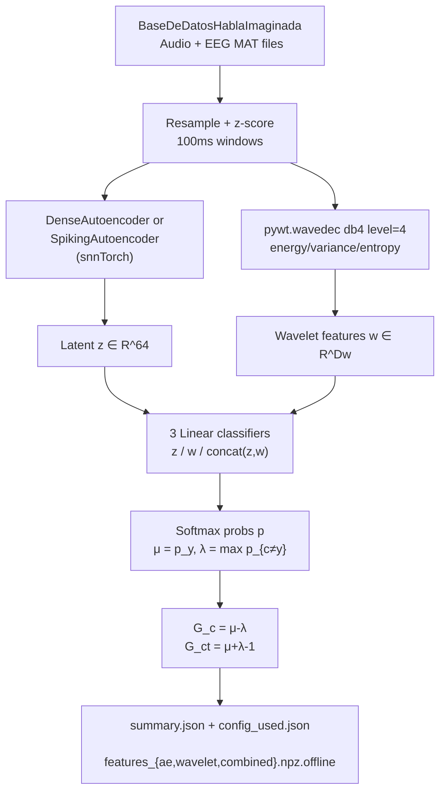

# Multimodal EEG + Audio Demo

Python prototype for multimodal EEG and audio fusion using autoencoders and paraconsistent analysis. Loads the *BaseDeDatosHablaImaginada* corpus, trains a dense or spiking autoencoder to compress each modality to a shared latent space, extracts complementary DWT statistics, and evaluates three linear classifiers under the Da Costa paraconsistent logic framework. Generates a JSON summary and NPZ feature archive.

---

## Theoretical Background

Multimodal fusion of EEG and audio for imagined speech is an open problem [Palazzo et al., 2020]. A joint autoencoder learns a shared latent manifold that separates speaker-specific patterns from session noise.

Paraconsistent analysis [Da Costa, 1974] applies after classification. Given class probability vector $\mathbf{p}$ and true label $y$:

$$\mu = p_y \quad (\text{belief in correct class}), \quad \lambda = \max_{c \neq y} p_c \quad (\text{belief in competing class})$$

$$G_c = \mu - \lambda \quad (\text{certainty degree}), \qquad G_{ct} = \mu + \lambda - 1 \quad (\text{contradiction degree})$$

High $G_c > 0$ with low $|G_{ct}|$ = confident and consistent. High $|G_{ct}|$ = model supports two competing hypotheses simultaneously — a paraconsistent state. This metric is novel to this thesis.

DWT statistics (energy, variance, entropy) follow Vetterli & Kovacevic (1995) as speaker-discriminative features.

---

## How It Is Implemented Here

**Source:** `src/demos/pyDemos/multimodal_eeg_audio/`

```python
# run_prototype.py pipeline (config.py: PrototypeConfig)
# 1. Preprocess: resample audio→target_audio_sr=16kHz, EEG→target_eeg_sr=200Hz;
#    z-score per window; window_sec=0.1 (100ms), overlap=0.5
# 2. build_autoencoder(): DenseAutoencoder OR SpikingAutoencoder (model_type default
#    "spiking"). SpikingAutoencoder: beta = exp(-dt/(R*C)) computed ONCE from
#    snn_resistance/snn_capacitance (fixed, not learnable); the SAME input window is
#    repeated snn_time_steps=5 times (not a sample-by-sample unroll of the 1600-sample
#    window) and fed through in_lif -> mid_lif -> out_lif each step; recon/latent are
#    the temporal MEAN over the 5 steps
# 3. Train on MSE; extract latent z ∈ R^64 per window
# 4. pywt.wavedec(signal, 'db4', level=4) → energy/variance/entropy → w ∈ R^D_w
# 5. Three linear classifiers: z, w, [z,w]
# 6. Paraconsistent: μ/λ from softmax → G_c, G_ct per sample → aggregate stats
# 7. Write summary.json + features.npz
```

---

## Data Flow



---

## How to Build and Run

```bash
pip install torch torchaudio snntorch pywavelets scipy numpy

python src/demos/pyDemos/multimodal_eeg_audio/run_prototype.py \
    --data-root /path/to/BaseDeDatosHablaImaginada \
    --output-dir results/multimodal_prototype \
    --epochs 20 \
    --batch-size 32 \
    --device cuda
```

**Key options:** `--data-root`, `--epochs`, `--batch-size`, `--device`, `--seed`, `--lr`, `--weight-decay`, `--no-save-features`.

**Expected output:**
```
results/multimodal_prototype/
  summary.json                    — train/val window counts, input_dim,
                                     ae_loss_history, accuracy + G_c/G_ct per classifier
                                     (ae / wavelet / combined)
  config_used.json                — the resolved PrototypeConfig, for reproducibility
  features_ae.npz.offline         — validation-set latent AE features (x) + speaker ids (y)
  features_wavelet.npz.offline    — validation-set wavelet features (x) + speaker ids (y)
  features_combined.npz.offline   — validation-set concat(ae, wavelet) features + ids
```
The `.npz.offline` suffix is deliberate: runtime `.npz` ingestion is disabled in this
build (project-wide convention), so these are offline-only artifacts, not files this
demo or any other component reads back in. There is no `training_curve.csv` —
per-epoch reconstruction loss lives in `summary.json`'s `ae_loss_history` list.

---

## Test Suite

`tests/` has pytest coverage for the pipeline's individual stages — `test_models.py`
(DenseAutoencoder/SpikingAutoencoder), `test_preprocess.py` (resampling/windowing),
`test_wavelet_features.py` (DWT energy/variance/entropy), `test_paraconsistent.py`
(μ/λ/G_c/G_ct):

```bash
cd src/demos/pyDemos/multimodal_eeg_audio
python -m pytest tests/ -v
```

There is no dataset-driven smoke test in `tests/`; to sanity-check the full CLI
pipeline against a real corpus, run with a small `--epochs`/`--batch-size` and check
`summary.json` for non-NaN accuracy values:

```bash
python run_prototype.py --data-root /path/to/data --epochs 2 --batch-size 8
```

---

## Common Pitfalls

1. **Native sample rate mismatch**: `--audio-orig-sr` defaults to 44100 Hz and `--eeg-orig-sr` defaults to 1000 Hz. If your corpus has different native rates, pass the correct values explicitly or resampling will produce wrong alignments.
2. **SpikingAutoencoder's T axis is not the audio window's time axis**: `SpikingAutoencoder.forward()` repeats the *same* already-flattened window vector `snn_time_steps=5` times (`x.unsqueeze(0).repeat(time_steps,1,1)`) and runs each identical copy through one LIF step; it does not chunk the window's 1600 samples into 5 pieces. `beta` is also a fixed constant (`exp(-dt/(R*C))`), not a learned parameter. The 5-step replication exists to give the LIF layers BPTT-style temporal dynamics on a static input, not to subsample the signal.
3. **CUDA out of memory**: the full dataset with `batch_size=64` may exceed GPU memory for large corpora. Reduce `--batch-size` or use `--device cpu`.

---

## See Also

- [Core/Paraconsistent](../Core/Paraconsistent.md) — Da Costa framework implementation
- [Concepts/Imagined-Speech-and-EEG](../Concepts/Imagined-Speech-and-EEG.md) — EEG imagined speech background
- [Concepts/Autoencoders](../Concepts/Autoencoders.md) — autoencoder theory
- [Experiments/Experiment05](../Experiments/Thesis.md) — thesis primary experiment using paraconsistent ranking

---

## References

[1] N. C. A. Da Costa, "On the theory of inconsistent formal systems," *Notre Dame J. Formal Logic*, vol. 15, pp. 497–510, 1974.

[2] S. Palazzo, C. Spampinato, I. Kavasidis, D. Giordano, J. Schmidt, and M. Shah, "Decoding brain representations by multimodal learning of neural activity and visual features," *IEEE Trans. Pattern Anal. Mach. Intell.*, vol. 43, pp. 3833–3849, 2020.

[3] M. Vetterli and J. Kovacevic, *Wavelets and Subband Coding*. Englewood Cliffs, NJ: Prentice Hall, 1995.
