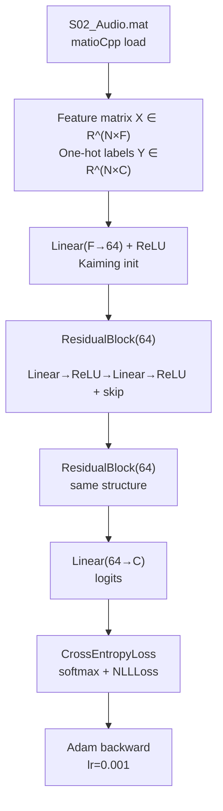

# ResNet Classifier Demo

Demonstrates a residual MLP (ResNet-style skip-connection network) trained on raw audio features from a single MAT subject file. Validates that `ResidualBlock`, `CrossEntropyLoss`, and `Adam` compose correctly and converge on a small classification problem.

---

## Theoretical Background

Residual connections [He et al., 2016] address gradient vanishing in deep networks by providing a shortcut path:

$$\mathbf{h}_{l+1} = F(\mathbf{h}_l, \{W_l\}) + \mathbf{h}_l$$

The shortcut guarantees a gradient of at least unit magnitude regardless of depth. For dense (fully-connected) residual blocks, the same principle applies as in the original image-classification ResNet.

Kaiming (He) initialisation [He et al., 2015] sets $\sigma_w = \sqrt{2 / \text{fan\_in}}$ to maintain activation variance through ReLU nonlinearities, replacing Xavier which is optimal for linear/tanh activations.

---

## How It Is Implemented Here

**Source:** `src/demos/cppDemos/resnet_classifier_demo/`

```cpp
// src/demos/cppDemos/resnet_classifier_demo/resnet_demo.cpp (structure)
// 1. Load Audio variable from S02_Audio.mat via matioCpp
// 2. Build X (N×F) and one-hot Y (N×C)
// 3. Architecture:
//    Linear(F→64) + ReLU
//    ResidualBlock(64) × 2
//    Linear(64→C)
// 4. CrossEntropyLoss + Adam(lr=0.001)
// 5. Train 1 epoch with batch_size=16
// 6. Print per-batch loss to stdout
```

---

## Data Flow



---

## How to Build and Run

```bash
cd /home/ensismoebius/Repos/doutorado/software/nn
cmake --preset=max-performance
cmake --build out/build/max-performance --target resnet_demo -j$(nproc)
./out/build/max-performance/src/demos/cppDemos/resnet_classifier_demo/resnet_demo
```

Expects `S02_Audio.mat` at a hard-coded path relative to the working directory. The demo runs 1 epoch (quick smoke test) and prints loss per batch.

---

## Test Suite

The `ResidualBlock` layer is covered by `core_gtest`:

```bash
cmake --build out/build/max-performance --target core_gtest -j$(nproc)
ctest --test-dir out/build/max-performance -R resnet --output-on-failure
```

---

## Common Pitfalls

1. **Missing MAT file**: the demo hard-codes the path to `S02_Audio.mat`. Running from a different directory causes a runtime error from matioCpp.
2. **Class count mismatch**: `C = max(labels) + 1`. If labels are 1-indexed (e.g., 1..5), `C = 6` but class 0 is empty. Subtract 1 from labels or adjust the label-building logic.
3. **Single-epoch evaluation**: with `epochs=1`, the demo is a forward-backward smoke test, not a convergence benchmark. Do not interpret the final loss as model quality.

---

## See Also

- [Concepts/Residual-Blocks](../Concepts/Residual-Blocks.md) — skip connection theory
- [Concepts/Weight-Initialisation](../Concepts/Weight-Initialisation.md) — Kaiming init
- [Core/Layers](../Core/Layers.md) — ResidualBlock implementation details

---

## References

[1] K. He, X. Zhang, S. Ren, and J. Sun, "Deep Residual Learning for Image Recognition," in *Proc. IEEE CVPR*, 2016, pp. 770–778.

[2] K. He, X. Zhang, S. Ren, and J. Sun, "Delving Deep into Rectifiers: Surpassing Human-Level Performance on ImageNet Classification," in *Proc. IEEE ICCV*, 2015, pp. 1026–1034.
