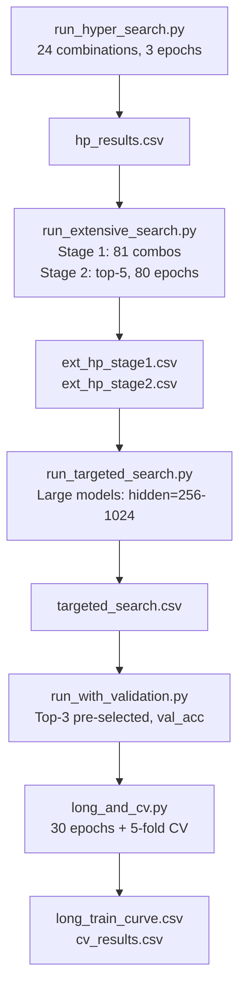

# SNN Hyperparameter Search

Suite of Python hyperparameter search scripts that tune the *speaker classifier*
(`ModeloSNN` + `treinar_classificador_locutor`) reused from the sibling
`voice_biometrics_snn_py` demo — not a standalone autoencoder; there is no
reconstruction target or bottleneck here, only speaker-identity classification
under different spike-readout loss modes. Implements a progressive staged strategy:
coarse grid → staged refinement → targeted large-model search → k-fold cross-validation
of top candidates.

---

## Theoretical Background

Staged hyperparameter search follows the successive halving (SHA) and HyperBand principles [Li et al., 2018]: allocate small budgets first, eliminate low performers, and concentrate compute on top candidates.

The Van Rossum distance [Rossum, 2001] is a biologically motivated spike train metric. Spike trains are convolved with an exponential kernel $\kappa(t) = e^{-t/\tau_c}$ before comparing with $L_2$ distance. Small $\tau_c$ = sensitive to precise spike timing; large $\tau_c$ = converges to rate-code MSE.

k-fold cross-validation [Kohavi, 1995] provides unbiased generalisation estimates, relevant for small imagined-speech corpora.

---

## How It Is Implemented Here

**Source:** `src/demos/pyDemos/snn_hyperparam_search/`

Four scripts with increasing search scope:

| Script | Combos | Epochs | Purpose |
|--------|--------|--------|---------|
| `run_hyper_search.py` | 24 | 3 | Quick elimination |
| `run_extensive_search.py` | 81 → top-5 | 8 → 80 | Two-stage |
| `run_targeted_search.py` | 36 | 80 | Large models |
| `run_with_validation.py` | 3 pre-selected | 10 | Val accuracy |
| `long_and_cv.py` | 1 best + top-3 | 30 + 10×5 | Long train + k-fold |

Search axes: `lr ∈ {1e-3, 5e-4, 1e-4}`, `hidden ∈ {32..1024}`, `loss_mode ∈ {rate, membrane, van_rossum, mse_vector}`, `num_passes ∈ {1..10}`.

```python
# Model (same ModeloSNN across all scripts, imported from voice_biometrics_snn_py):
# Input x ∈ R^num_bandas → codificar_poisson → spikes ∈ {0,1}^(T×num_bandas)
# fc_in: Linear(num_bandas→hidden) → Leaky LIF (beta fixed 0.9)
# ResidualSNNBlock × num_blocos_residuais (skip connections)
# fc_out: Linear(hidden→n_speakers) → Leaky LIF
# spk_out_seq [T,B,n_speakers] (+ mem_trace) → compute_loss(loss_mode, ...):
#   rate/monte_carlo: cross_entropy(sum_t(spikes), target_class)
#   temporal_pooling: cross_entropy(windowed spike-count pooling, target_class)
#   van_rossum: mse_loss(PSC-filtered spike sum, one-hot target)
#   membrane: mse_loss(sum_t(mem_trace), one-hot target) — falls back to
#             cross_entropy on spike counts if mem_trace isn't differentiable
#   cosine: 1 - cosine_similarity(readout, one-hot target)
#   mse_vector: mse_loss(readout, one-hot target)
# `num_passes` (_forward_multi_pass): re-runs the SAME encoded spike batch through
# the model that many times and averages the outputs, to reduce the stochastic
# Poisson encoder's variance — not a network-depth or latent-space concept

```

---

## Data Flow



---

## How to Build and Run

```bash
pip install torch snntorch numpy pandas scikit-learn

# Quick grid (24 combos, fast)
python src/demos/pyDemos/snn_hyperparam_search/run_hyper_search.py

# Extensive two-stage search
python src/demos/pyDemos/snn_hyperparam_search/run_extensive_search.py

# Targeted large-model search
python src/demos/pyDemos/snn_hyperparam_search/run_targeted_search.py

# Validation run (pre-selected configs)
python src/demos/pyDemos/snn_hyperparam_search/run_with_validation.py

# Long training + 5-fold CV
python src/demos/pyDemos/snn_hyperparam_search/long_and_cv.py
```

---

## Test Suite

`tests/test_snn_hyperparam.py` has pytest coverage for the grid-construction and
CSV-writing logic (`TestGridConstruction`, `TestCsvWriting`) — it does not train a
model, only validates the search-script scaffolding:

```bash
cd src/demos/pyDemos/snn_hyperparam_search
python -m pytest tests/ -v
```

For an end-to-end sanity check, run `run_hyper_search.py` and confirm
`experiments/hp_results.csv` contains 24 rows (`lr×hidden×loss_mode×num_passes`
= 2×2×3×2) and that `final_loss` trends down across the 3 training epochs for
most configurations.

---

## Common Pitfalls

1. **`van_rossum` loss with small $\tau_c$**: the Van Rossum kernel integrates over spike trains; very small $\tau_c$ makes the loss hyper-sensitive to exact spike timing, causing vanishing gradients when spikes are rare.
2. **Large hidden + many passes**: `run_targeted_search.py` explores `hidden=1024, num_passes=10`. This can exhaust GPU memory on a single 8 GB card. None of these scripts expose a CLI (`argparse`) — grid ranges, dataset dir, and device are hardcoded module-level constants; edit the script directly to reduce the grid or force CPU.
3. **Non-reproducible results without seed**: the scripts use `seed=42` for train/val split but not always for weight initialisation. Re-runs may give slightly different final losses.

---

## See Also

- [Concepts/K-Fold-Cross-Validation](../Concepts/K-Fold-Cross-Validation.md) — k-fold theory
- [Concepts/SNN-and-Surrogate-Gradients](../Concepts/SNN-and-Surrogate-Gradients.md) — spiking network training
- [Concepts/Spike-Encoding](../Concepts/Spike-Encoding.md) — rate vs latency coding

---

## References

[1] L. Li, K. Jamieson, G. DeSalvo, A. Rostamizadeh, and A. Talwalkar, "Hyperband: A novel bandit-based approach to hyperparameter optimization," *J. Mach. Learn. Res.*, vol. 18, no. 185, pp. 1–52, 2018.

[2] M. C. W. van Rossum, "A novel spike distance," *Neural Comput.*, vol. 13, no. 4, pp. 751–763, 2001.

[3] R. Kohavi, "A study of cross-validation and bootstrap for accuracy estimation and model selection," in *Proc. IJCAI*, 1995, pp. 1137–1143.
