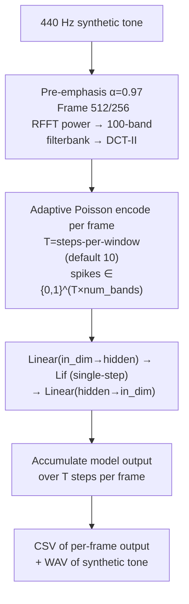

# SNN Speaker Demo

CLI scaffold for a Spiking Neural Network (SNN) speaker identification/verification
pipeline. Only its `demo` subcommand is actually implemented: a 440 Hz synthetic tone
is processed through a filterbank-based LFCC-style front-end, adaptively Poisson-encoded
into spike trains, and fed through a small untrained `Linear → Lif → Linear` network
(single-step LIF, no BPTT). The `capturar`/`treinar`/`identificar`/`verificar`/`avaliar`
subcommands are argument-parsing stubs — see below.

---

## Theoretical Background

Speaker recognition with SNNs is motivated by biological plausibility and energy efficiency on neuromorphic hardware [Mahowald & Douglas, 1991]. The residual `LifBPTT`-based architecture in `rede_snn.cpp` (built but not wired into the `demo` pipeline) follows Fang et al. (2021), where learnable membrane time constants ($\beta$ via $R$, $C$) and skip connections stabilise BPTT [Fang et al., 2021]; the `demo` subcommand's own model is a plain single-step `Lif` layer with no BPTT and no residual connection.

Adaptive Poisson rate encoding normalises firing rates across stimuli of varying amplitude:
$$r_{\max} = \text{clamp}\!\left(\frac{r_\text{target}}{\bar{x} + \varepsilon},\; 0.02,\; 0.5\right), \quad s_i[t] \sim \text{Bernoulli}(\text{clamp}(x_i \cdot r_{\max}, 0, 1))$$

LIF membrane dynamics (see [Concepts/Membrane-Dynamics](../Concepts/Membrane-Dynamics.md)):
$$V[t] = \beta\, V[t-1] + (1-\beta)\, R\, I[t], \qquad \beta = e^{-\Delta t/(R \cdot C)}$$

---

## How It Is Implemented Here

**Source:** `src/demos/cppDemos/snn_speaker_demo/`  
**Build artefacts:** `rede_snn` (shared library, unused by the `demo` subcommand — see below) + `speaker_demo` (CLI binary)

Only the `demo` subcommand is actually implemented; `capturar`, `treinar`, `identificar`,
`verificar`, `avaliar` are stubs in `speaker_demo.cpp` that log their arguments and
`return 0` without doing any capture/training/inference. The `demo` pipeline
(`comandos.cpp: cmd_demo`) is:

```cpp
// extract_feature_windows(): pre-emphasis(0.97) -> framing_and_window(window_size/hop_size)
//   -> rfft_power -> build_linear_filterbank(num_bands) -> dot_power_filterbank -> dct2
//   -> (num_frames, num_bands) feature matrix
//
// create_snn_model(in_dim, num_bands): Linear(in_dim -> hidden) -> Lif(single-step,
//   R=1,C=1,thr=1) -> Linear(hidden -> in_dim); hidden = max(8, num_bands)
//
// run_inference(): per feature frame, codificacao::encode_poisson() into
//   steps_per_window spike steps, forward each step through the model, accumulate
//   output over the window
//
// write_demo_outputs(): CSV of per-frame accumulated output + WAV of the synthetic tone
```

`rede_snn.cpp` defines a separate, more elaborate `SnnModel`
(`Linear(100->100) -> LifBPTT -> ResidualSNNBlock x3 -> Linear(100->10) -> LifBPTT
readout`) built as its own shared library target, but nothing in `speaker_demo` links
against or loads it — it is not part of the `demo` subcommand's actual pipeline.

Feature extraction pipeline: pre-emphasis → framing (window_size/hop_size, default 512/256)
→ RFFT power → `num_bands`-band linear filterbank → DCT-II → `num_bands`-D feature vector
per frame (default 100 bands).

---

## Data Flow



---

## How to Build and Run

```bash
cd /home/ensismoebius/Repos/doutorado/software/nn
cmake --preset=max-performance
cmake --build out/build/max-performance --target speaker_demo -j$(nproc)

# Demo mode (synthetic 440 Hz tone)
./out/build/max-performance/src/demos/cppDemos/snn_speaker_demo/speaker_demo demo

# Custom duration and steps per window
./out/build/max-performance/src/demos/cppDemos/snn_speaker_demo/speaker_demo demo \
    --duracao 2.0 --passos-por-janela 20
```

Available subcommands: `demo`, `capturar`, `treinar`, `identificar`, `verificar`, `avaliar` —
only `demo` is functional; the rest log their parsed arguments and return 0. `demo`'s
flags (all optional, Portuguese names): `--duracao` (default 1.0), `--taxa-amostragem`
(44100), `--tamanho-janela` (512), `--tamanho-passo` (256), `--wavelet` (`db4`, unused by
the actual pipeline — see below), `--num-bandas` (100), `--passos-por-janela` (10),
`--profundidade` (-1, unused), `--saida-plot` (`result_pipeline_wpt_snn.png`, the CSV output
path — the WAV is written to `<saida-plot>.wav`).

---

## Test Suite

The demo has its own gtest target (`CodificacaoTest` fixture — covers
`compute_adaptive_max_rate` and `encode_poisson` from `codificacao.cpp`: rate clamping,
output shape, binariness, adaptive spike density):

```bash
cmake --build out/build/max-performance --target snn_speaker_demo_gtest -j$(nproc)
ctest --test-dir out/build/max-performance -R CodificacaoTest --output-on-failure
```

The unused `rede_snn` shared library's `LifBPTT`/`Lif` layer mechanics are additionally
covered by `core_gtest`.

---

## Common Pitfalls

1. **Single-step, not BPTT**: `run_inference()` calls `model->forward()` one spike row at a time (`spikes.row(t)`), not a single time-major `(T·B, F)` batched call — the `demo` subcommand's `Lif` layer is stateful single-step, unrelated to `LifBPTT`/BPTT training. See [Concepts/Time-Major-Layout](../Concepts/Time-Major-Layout.md) for the convention used elsewhere in the project (e.g. `rede_snn.cpp`'s unused `SnnModel`).
2. **`reset_state()` called once, not per frame**: `run_inference()` calls `model->reset_state()` once before the frame loop, so membrane state carries over between feature frames within a single `demo` run — intentional here (there is no cross-utterance boundary in the synthetic-tone demo), but a pitfall to watch for when adapting this code to multiple utterances.
3. **The model is never trained**: `create_snn_model()` only Kaiming-initialises weights; `cmd_demo()` never calls an optimizer or loss. The `demo` subcommand is a forward-pass wiring smoke test, not a classifier.

---

## See Also

- [Concepts/Membrane-Dynamics](../Concepts/Membrane-Dynamics.md) — LIF dynamics
- [Concepts/Time-Major-Layout](../Concepts/Time-Major-Layout.md) — tensor shape convention
- [Demos/wpt-voice-biometrics](./wpt-voice-biometrics.md) — C++ counterpart using WPT instead of LFCC

---

## References

[1] M. Mahowald and R. Douglas, "A silicon neuron," *Nature*, vol. 354, pp. 515–518, 1991.

[2] W. Fang et al., "Incorporating Learnable Membrane Time Constants to Enhance Learning of Spiking Neural Networks," in *Proc. IEEE/CVF ICCV*, 2021, pp. 2661–2671.

[3] S. B. Shrestha and G. Orchard, "SLAYER: Spike Layer Error Reassignment in Time," in *Proc. NeurIPS*, 2018, pp. 1412–1421.
