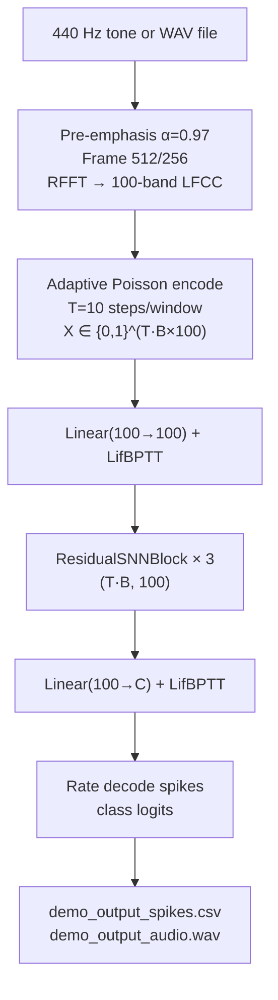

# SNN Speaker Demo

End-to-end CLI demonstrating a Spiking Neural Network (SNN) pipeline for speaker identification and verification. A 440 Hz synthetic audio signal (or a WAV file) is processed through a wavelet-based LFCC front-end, adaptively Poisson-encoded into spike trains, and fed to a residual SNN (`Linear → LifBPTT` blocks) trained via BPTT with exponential surrogate gradients.

---

## Theoretical Background

Speaker recognition with SNNs is motivated by biological plausibility and energy efficiency on neuromorphic hardware [Mahowald & Douglas, 1991]. The residual SNN architecture follows Fang et al. (2021), where learnable membrane time constants ($\beta$ via $R$, $C$) and skip connections stabilise BPTT [Fang et al., 2021].

Adaptive Poisson rate encoding normalises firing rates across stimuli of varying amplitude:
$$r_{\max} = \text{clamp}\!\left(\frac{r_\text{target}}{\bar{x} + \varepsilon},\; 0.02,\; 0.5\right), \quad s_i[t] \sim \text{Bernoulli}(\text{clamp}(x_i \cdot r_{\max}, 0, 1))$$

LIF membrane dynamics (see [Concepts/Membrane-Dynamics](../Concepts/Membrane-Dynamics.md)):
$$V[t] = \beta\, V[t-1] + (1-\beta)\, R\, I[t], \qquad \beta = e^{-\Delta t/(R \cdot C)}$$

---

## How It Is Implemented Here

**Source:** `src/demos/cppDemos/snn_speaker_demo/`  
**Build artefacts:** `rede_snn` (shared library) + `speaker_demo` (CLI binary)

```cpp
// Architecture: time-major (T*B, F) input
// Linear(F → hidden_size=100)
// LifBPTT(T, surrogate=ExponentialSurrogate)
// ResidualSNNBlock × 3:
//   Linear(hidden→hidden) → LifBPTT
//   Linear(hidden→hidden) → LifBPTT
//   skip: z + x
// Linear(hidden → n_classes)
// LifBPTT (readout)
// Rate-decode output spikes → class logits
```

Feature extraction pipeline: pre-emphasis → framing (512/256) → RFFT → 100-band linear filterbank → DCT-II → 100D LFCC.

---

## Data Flow



---

## How to Build and Run

```bash
cd /home/ensismoebius/Repos/doutorado/software/nn
cmake --preset=max-performance
cmake --build out/build/max-performance --target speaker_demo -j$(nproc)

# Demo mode (synthetic 440 Hz tone)
./out/build/max-performance/src/demos/cppDemos/snn_speaker_demo/speaker_demo demo

# Custom duration and hidden size
./out/build/max-performance/src/demos/cppDemos/snn_speaker_demo/speaker_demo demo \
    --duracao 2.0 --hidden 128 --passos-por-janela 20
```

Available subcommands: `demo`, `capturar`, `treinar`, `identificar`, `verificar`, `avaliar`.

---

## Test Suite

The shared library is tested via `core_gtest` (spiking layer tests). The demo itself has no standalone test binary — use the `demo` subcommand as a smoke test:

```bash
cmake --build out/build/max-performance --target core_gtest -j$(nproc)
ctest --test-dir out/build/max-performance -R Lif --output-on-failure
```

---

## Common Pitfalls

1. **Time-major shape**: the SNN expects input of shape $(T \cdot B, F)$. Ensure Poisson-encoded spikes are packed with all time=0 rows first. See [Concepts/Time-Major-Layout](../Concepts/Time-Major-Layout.md).
2. **LIF learning rate scale**: biophysical parameters ($R$, $C$, $V_\text{th}$) need ~10× smaller lr than weights. Use `Optimizer::attach_with_scales()` with `snn_lr_scale = 0.1`.
3. **`reset_state()` between utterances**: the shared library's `rede_snn` holds persistent membrane state. Call `reset_state()` before processing each new speaker sample.

---

## See Also

- [Concepts/Membrane-Dynamics](../Concepts/Membrane-Dynamics.md) — LIF dynamics
- [Concepts/Time-Major-Layout](../Concepts/Time-Major-Layout.md) — tensor shape convention
- [Demos/wpt-voice-biometrics](./wpt-voice-biometrics.md) — C++ counterpart using WPT instead of LFCC

---

## References

[1] M. Mahowald and R. Douglas, "A silicon neuron," *Nature*, vol. 354, pp. 515–518, 1991.

[2] W. Fang et al., "Incorporating Learnable Membrane Time Constants to Enhance Learning of Spiking Neural Networks," in *Proc. IEEE/CVF ICCV*, 2021, pp. 2661–2671.

[3] S. B. Shrestha and G. Orchard, "SLAYER: Spike Layer Error Reassignment in Time," in *Proc. NeurIPS*, 2018, pp. 1412–1421.
