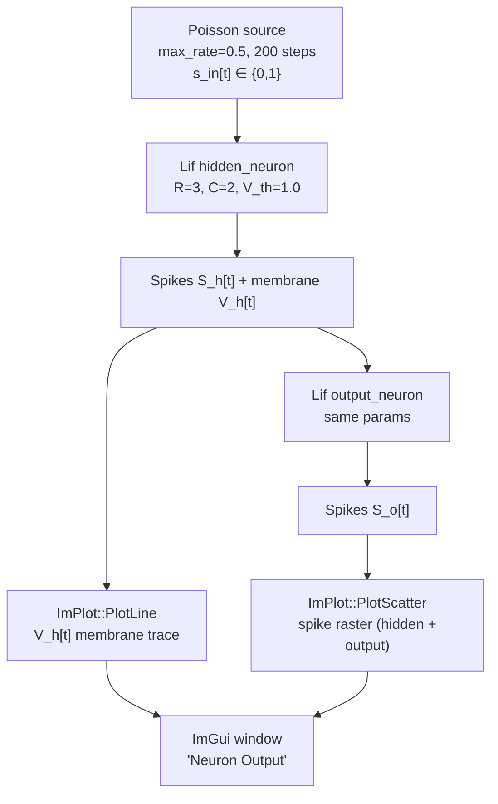

# SNN Spike Plotter

Real-time interactive visualisation of a two-neuron LIF chain driven by Poisson spike input. Renders a spike raster and continuous membrane-potential trace side by side using ImGui + ImPlot, allowing visual verification of neuron dynamics, threshold crossing, and reset behaviour without a training loop.

---

## Theoretical Background

The Leaky Integrate-and-Fire model is the canonical point-neuron model in computational neuroscience [Lapicque, 1907; Gerstner & Kistler, 2002]:

$$C \frac{dV}{dt} = -\frac{V}{R} + I(t), \qquad V \leftarrow 0 \text{ if } V \geq V_\text{th}$$

Discretised with step $\Delta t$: $V[t] = \beta V[t-1] + R \cdot I[t]$, $\beta = e^{-\Delta t/(RC)}$.

For $R = 3$, $C = 2$: $\tau_m = 6$, $\beta \approx 0.846$ (slow decay, integrates well).

The Poisson spike model [Dayan & Abbott, 2001] generates $s[t] \sim \text{Bernoulli}(r_{\max})$. With $r_{\max} = 0.5$, roughly half of time steps carry a spike. This is the simplest rate-coded encoding scheme.

---

## How It Is Implemented Here

**Source:** `src/demos/cppDemos/snn_spike_plotter/plotSpikingNetwork.cpp`

```cpp
// plotSpikingNetwork.cpp (structure)
// 1. Generate spike input via generate_autoencoder_spike_data(1, 1, n_steps=200, max_rate=0.5)
// 2. Two Lif neurons (single-step): R=3, C=2, V_th=1.0
// 3. ImGui frame loop:
//    for each render frame:
//      hidden_spikes = hidden_neuron.forward(input[t])
//      output_spikes = output_neuron.forward(hidden_spikes)
//      ImGui::Begin("Neuron Output")
//      ImPlot::PlotScatter("Spikes", times, neuron_ids)
//      ImPlot::PlotLine("V_hidden", times, V_hidden)
```

No training; pure forward simulation of 200 steps replayed each render frame.

---

## Data Flow



---

## How to Build and Run

```bash
cd /home/ensismoebius/Repos/doutorado/software/nn
cmake --preset=max-performance
cmake --build out/build/max-performance --target plotSpikingNetwork -j$(nproc)
./out/build/max-performance/src/demos/cppDemos/snn_spike_plotter/plotSpikingNetwork
```

Requires a display (X11/Wayland) and OpenGL. On headless servers, use a virtual framebuffer (`Xvfb`).

**Expected output:** interactive GUI window with two panels — spike raster and membrane potential.

---

## Test Suite

LIF single-step forward/backward is covered by `core_gtest`:

```bash
cmake --build out/build/max-performance --target core_gtest -j$(nproc)
ctest --test-dir out/build/max-performance -R Lif --output-on-failure
```

---

## Common Pitfalls

1. **No display available**: ImGui requires an OpenGL context. On CI or SSH servers without `DISPLAY`, the binary will crash at GLFW init. Use `Xvfb :99 &` and `DISPLAY=:99` as a workaround.
2. **Single-step vs BPTT**: this demo uses `LifImpl` (single-step), not `LifBPTTImpl`. The single-step variant does not accept a `(T*B, F)` input — it processes one time step per call. Do not substitute `LifBPTTImpl` here without restructuring the loop.
3. **State persistence across frames**: the ImGui frame loop replays all 200 steps from the same initial state each render frame. If you want continuous simulation, call `reset_state()` once at startup and remove the replay; accumulate state across frames instead.

---

## See Also

- [Concepts/Membrane-Dynamics](../Concepts/Membrane-Dynamics.md) — LIF RC circuit theory
- [Concepts/SNN-and-Surrogate-Gradients](../Concepts/SNN-and-Surrogate-Gradients.md) — training spiking networks
- [Core/Layers](../Core/Layers.md) — `LifImpl` and `LifBPTTImpl` comparison

---

## References

[1] L. Lapicque, "Recherches quantitatives sur l'excitation électrique des nerfs traitée comme une polarisation," *J. Physiol. Pathol. Gen.*, vol. 9, pp. 620–635, 1907.

[2] W. Gerstner and W. M. Kistler, *Spiking Neuron Models*. Cambridge, UK: Cambridge University Press, 2002.

[3] P. Dayan and L. F. Abbott, *Theoretical Neuroscience*. Cambridge, MA: MIT Press, 2001.
