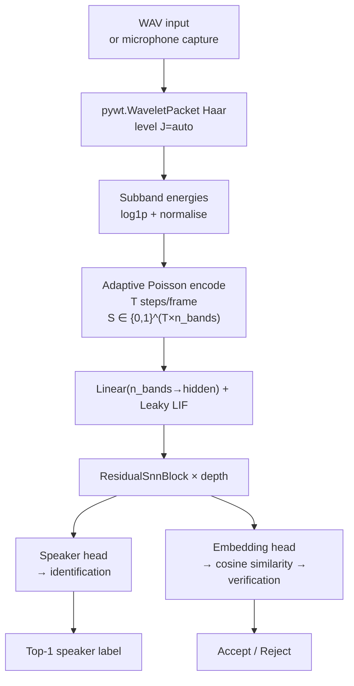

# Voice Biometrics SNN (Python)

Python counterpart to the C++ `wpt_voice_biometrics` demo. Implements a full speaker biometrics CLI: enrol speakers, train a deep residual SNN (WPT → Poisson → SNN), and run identification or verification from the command line. Powered by PyTorch + snnTorch with pywt wavelet front-end.

---

## Theoretical Background

The pipeline mirrors the C++ demo but adds a trained classification head and threshold-based verification. WPT subband energy features [Coifman & Wickerhauser, 1992] are Poisson-encoded into spike trains and processed by a deep residual SNN following the architecture of Fang et al. [2021].

Speaker verification is cast as a one-vs-all binary classification after projection to a speaker embedding space. A threshold $\theta$ on cosine similarity between a test embedding and an enrolled speaker prototype controls the trade-off between false-acceptance and false-rejection rates.

Residual SNN blocks use additive skip connections on spike outputs [He et al., 2016] to preserve gradient flow through deep LIF chains trained via BPTT with the exponential surrogate gradient:

$$\frac{\partial S}{\partial V} \approx \frac{1}{\beta_s} e^{-|V - V_\text{th}| / \beta_s}$$

---

## How It Is Implemented Here

**Source:** `src/demos/pyDemos/voice_biometrics_snn_py/`

Key source files:

| File | Role |
|------|------|
| `app/main.py` | CLI entry point; argument parsing; dispatches subcommands |
| `rede_snn.py` | Deep residual SNN definition (snnTorch `Leaky`, learn_beta=True) |
| `caracteristicas.py` | WPT feature extraction using `pywt.WaveletPacket` |
| `codificacao.py` | Adaptive Poisson encoding (mirrors C++ `PoissonEncoder`) |

```python
# rede_snn.py (structure)
# Linear(n_bands → hidden) → Leaky LIF
# ResidualBlock(hidden) × depth  ← spike + skip
# Linear(hidden → n_classes)     ← speaker head
# Linear(hidden → embed_dim)     ← embedding head (for verify)
```

Subcommands exposed by `app/main.py`:

| Subcommand | Alias | Purpose |
|-----------|-------|---------|
| `demo` | — | Synthetic signal smoke test |
| `capturar` / `enrolar` | — | Record/import audio; store speaker template |
| `treinar` | — | Train SNN on enrolled data |
| `identificar` | — | Top-1 speaker ID from WAV input |
| `verificar` | — | Accept/reject against enrolled speaker |
| `avaliar` | — | Accuracy + EER on held-out set |

---

## Data Flow



---

## How to Build and Run

```bash
pip install torch snntorch pywavelets matplotlib sounddevice scipy numpy

# Smoke test with synthetic signal
python src/demos/pyDemos/voice_biometrics_snn_py/app/main.py demo

# Enrol a speaker from a WAV file
python src/demos/pyDemos/voice_biometrics_snn_py/app/main.py \
    enrolar --speaker-id "alice" --wav alice_enrol.wav

# Train on enrolled data
python src/demos/pyDemos/voice_biometrics_snn_py/app/main.py \
    treinar --epochs 30 --lr 1e-3

# Identify speaker from test WAV
python src/demos/pyDemos/voice_biometrics_snn_py/app/main.py \
    identificar --wav test_utterance.wav

# Verify against enrolled speaker
python src/demos/pyDemos/voice_biometrics_snn_py/app/main.py \
    verificar --speaker-id "alice" --wav test_utterance.wav --threshold 0.7

# Evaluate on a directory of labelled WAVs
python src/demos/pyDemos/voice_biometrics_snn_py/app/main.py \
    avaliar --data-root /path/to/corpus
```

---

## Test Suite

No formal test binary. Smoke test with `demo` subcommand. Integration test: enrol two synthetic speakers, train 5 epochs, run `identificar` — top-1 must equal the enrolled speaker for the enrolment utterance itself.

---

## Common Pitfalls

1. **`sounddevice` not available on headless servers**: the `capturar` subcommand requires a microphone. On CI or remote systems, use `enrolar --wav` instead.
2. **Short enrolment utterances**: very short WAV files (< 1 s) may yield fewer than 10 frames after windowing, which is insufficient for stable speaker template estimation. Enrol with ≥ 3 s per speaker.
3. **Python path issues**: `app/main.py` imports `rede_snn` and `caracteristicas` using relative imports. Run from the `voice_biometrics_snn_py/` directory or install the package with `pip install -e .`.

---

## See Also

- [Demos/wpt-voice-biometrics](./wpt-voice-biometrics.md) — C++ counterpart with same WPT front-end
- [Demos/snn-speaker-demo](./snn-speaker-demo.md) — LFCC-based C++ speaker ID
- [Concepts/SNN-and-Surrogate-Gradients](../Concepts/SNN-and-Surrogate-Gradients.md) — spiking network training
- [Concepts/Spike-Encoding](../Concepts/Spike-Encoding.md) — Poisson encoding theory
- [Core/Wavelet](../Core/Wavelet.md) — WPT API

---

## References

[1] R. R. Coifman and M. V. Wickerhauser, "Entropy-based algorithms for best basis selection," *IEEE Trans. Inf. Theory*, vol. 38, no. 2, pp. 713–718, 1992.

[2] W. Fang et al., "Incorporating Learnable Membrane Time Constants to Enhance Learning of Spiking Neural Networks," in *Proc. IEEE/CVF ICCV*, 2021, pp. 2661–2671.

[3] K. He, X. Zhang, S. Ren, and J. Sun, "Deep residual learning for image recognition," in *Proc. IEEE CVPR*, 2016, pp. 770–778.
