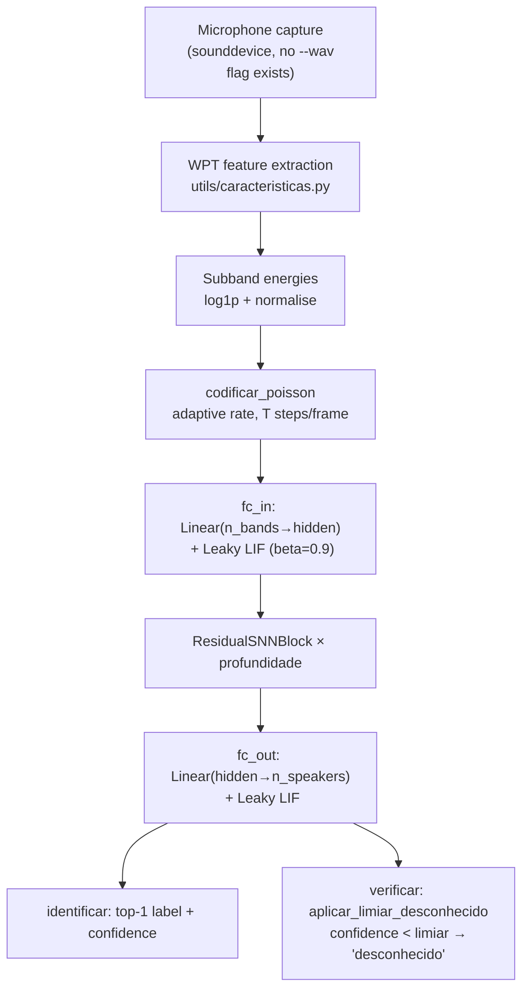

# Voice Biometrics SNN (Python)

Python counterpart to the C++ `wpt_voice_biometrics` demo. Implements a full speaker biometrics CLI: enrol speakers, train a deep residual SNN (WPT → Poisson → SNN), and run identification or verification from the command line. Powered by PyTorch + snnTorch with pywt wavelet front-end.

---

## Theoretical Background

The pipeline mirrors the C++ demo but adds a trained classification head and confidence-threshold-based "unknown" rejection. WPT subband energy features [Coifman & Wickerhauser, 1992] are Poisson-encoded into spike trains and processed by a residual SNN in the spirit of Fang et al. [2021] (learnable-time-constant SNNs), though this demo's `snn.Leaky` layers use a fixed `beta=0.9`, not a learned time constant.

Speaker verification here is **not** embedding/cosine-similarity based: `identificar`/`verificar` both run the same top-1 classification head (`identificar_locutor_por_microfone`), and `verificar` additionally applies `aplicar_limiar_desconhecido(pessoa, confianca, limiar)` — if the top-1 softmax-style confidence is below `--limiar` (default 0.55), the result is replaced with `"desconhecido"` instead of the predicted label.

Residual SNN blocks use additive skip connections on spike outputs [He et al., 2016] to preserve gradient flow through deep LIF chains. `snn.Leaky()` is constructed with no `spike_grad` argument, so training uses snnTorch's library default surrogate (fast sigmoid), not an explicit exponential surrogate.

---

## How It Is Implemented Here

**Source:** `src/demos/pyDemos/voice_biometrics_snn_py/`

Key source files (paths relative to `src/demos/pyDemos/voice_biometrics_snn_py/`):

| File | Role |
|------|------|
| `app/main.py` | `argparse` CLI: builds the 6 subparsers, wires each to a `cmd_*` in `comandos.py` |
| `app/comandos.py` | Implements `cmd_demo`, `cmd_capturar`, `cmd_treinar`, `cmd_identificar`, `cmd_verificar`, `cmd_avaliar` |
| `services/modelos/rede_snn.py` | `ModeloSNN` + `ResidualSNNBlock` (snnTorch `Leaky`, fixed `beta=0.9`) |
| `utils/caracteristicas.py` | WPT feature extraction |
| `utils/codificacao.py` | Adaptive Poisson encoding (`codificar_poisson`) |
| `services/identificacao_locutor.py` | Microphone capture → inference, `aplicar_limiar_desconhecido` |
| `services/cadastro.py`, `infra/captura.py` | Live audio capture + on-disk sample storage |

```python
# services/modelos/rede_snn.py — ModeloSNN (structure)
# fc_in: Linear(num_entradas -> num_ocultos); lif_in: snn.Leaky(beta=0.9)
# res_blocks: ResidualSNNBlock(num_ocultos, beta=0.9) x numero_de_blocos_residuais
#   each block: Linear->Leaky->Linear->Leaky, returns spk2 + x  (skip)
# fc_out: Linear(num_ocultos -> num_saidas); lif_out: snn.Leaky(beta=0.9)
# No separate embedding head — verification reuses the same classification head.
```

Subcommands exposed by `app/main.py` (all six are implemented, unlike the C++
`speaker_demo` counterpart where only `demo` is):

| Subcommand | Purpose |
|-----------|---------|
| `demo` | Captures live audio (`--duracao`, default 1.0 s) via the microphone, runs the full pipeline, writes plots to `--saida-plot` |
| `capturar` | Records live audio for `--pessoa` and stores it under `--diretorio-dados` |
| `treinar` | Trains `ModeloSNN` on captured data, saves `--saida-modelo` / `--saida-rotulos` |
| `identificar` | Captures live audio, prints top-1 predicted speaker + confidence |
| `verificar` | Same as `identificar`, but replaces the result with `"desconhecido"` if confidence < `--limiar` |
| `avaliar` | Evaluates the saved model over `--diretorio-dados`, prints a confusion matrix |

There is no `--wav` flag anywhere in the CLI — `demo`, `identificar`, `verificar` all
capture audio live via `sounddevice`, they do not accept a pre-recorded file.

---

## Data Flow



---

## How to Build and Run

```bash
pip install torch snntorch pywavelets matplotlib sounddevice scipy numpy

cd src/demos/pyDemos/voice_biometrics_snn_py
# Run as a module (app/comandos.py uses absolute imports like `from core.configs
# import ...`, so `python -m app.main` from this directory is required — running
# `python app/main.py` directly fails to resolve those imports).

# Visual smoke test: captures 1s of live audio, runs the pipeline, saves plots
python -m app.main demo

# Capture (record) a live sample for a speaker into dados/vozes/
python -m app.main capturar --pessoa alice --duracao 3.0

# Train on captured speakers
python -m app.main treinar --epocas 30 --lr 1e-3

# Identify speaker from a fresh live recording (microphone, no --wav flag)
python -m app.main identificar

# Verify with an "unknown" confidence threshold
python -m app.main verificar --limiar 0.7

# Evaluate the saved model over dados/vozes/
python -m app.main avaliar --diretorio-dados dados/vozes
```

---

## Test Suite

`tests/` has pytest coverage for the pure-logic helpers (not the microphone/model
path): `TestAplicarLimiarDesconhecido` (`tests/test_domain.py`, the unknown-speaker
threshold rule) and `TestCalcularTaxaMaxAdaptativa` / `TestCodificarPoisson`
(`tests/test_utils.py`, adaptive Poisson rate + encoding).

```bash
cd src/demos/pyDemos/voice_biometrics_snn_py
python -m pytest tests/ -v
```

No automated test exercises the live-microphone `capturar`/`identificar`/`verificar`
paths — those require manual smoke testing with a real microphone.

---

## Common Pitfalls

1. **`sounddevice` not available on headless servers**: `capturar`, `demo`, `identificar`, and `verificar` all require a working microphone — there is no `--wav` flag anywhere in the CLI to substitute a pre-recorded file. On CI or remote systems these subcommands cannot run; only `treinar`/`avaliar` over already-captured `dados/vozes/` samples, and the pytest suite, are headless-safe.
2. **Short captured utterances**: very short recordings (< 1 s) may yield fewer than 10 frames after windowing, insufficient for stable speaker template estimation. Capture with `--duracao` ≥ 3 s per speaker (the `capturar` default).
3. **Module import path**: `app/comandos.py` imports with absolute package paths (`from core.configs import ...`, `from services.modelos.rede_snn import ...`). Run with `python -m app.main <subcommand>` from inside `voice_biometrics_snn_py/` — invoking `python app/main.py` directly leaves those top-level packages (`core`, `services`, `utils`, `infra`) off `sys.path` and import fails.

---

## See Also

- [Demos/wpt-voice-biometrics](./wpt-voice-biometrics.md) — C++ counterpart with same WPT front-end
- [Demos/snn-speaker-demo](./snn-speaker-demo.md) — LFCC-based C++ speaker ID
- [Concepts/SNN-and-Surrogate-Gradients](../Concepts/SNN-and-Surrogate-Gradients.md) — spiking network training
- [Concepts/Spike-Encoding](../Concepts/Spike-Encoding.md) — Poisson encoding theory
- [Core/Wavelet](../Core/Wavelet.md) — WPT API

---

## References

[1] R. R. Coifman and M. V. Wickerhauser, "Entropy-based algorithms for best basis selection," *IEEE Trans. Inf. Theory*, vol. 38, no. 2, pp. 713–718, 1992.

[2] W. Fang et al., "Incorporating Learnable Membrane Time Constants to Enhance Learning of Spiking Neural Networks," in *Proc. IEEE/CVF ICCV*, 2021, pp. 2661–2671.

[3] K. He, X. Zhang, S. Ren, and J. Sun, "Deep residual learning for image recognition," in *Proc. IEEE CVPR*, 2016, pp. 770–778.
