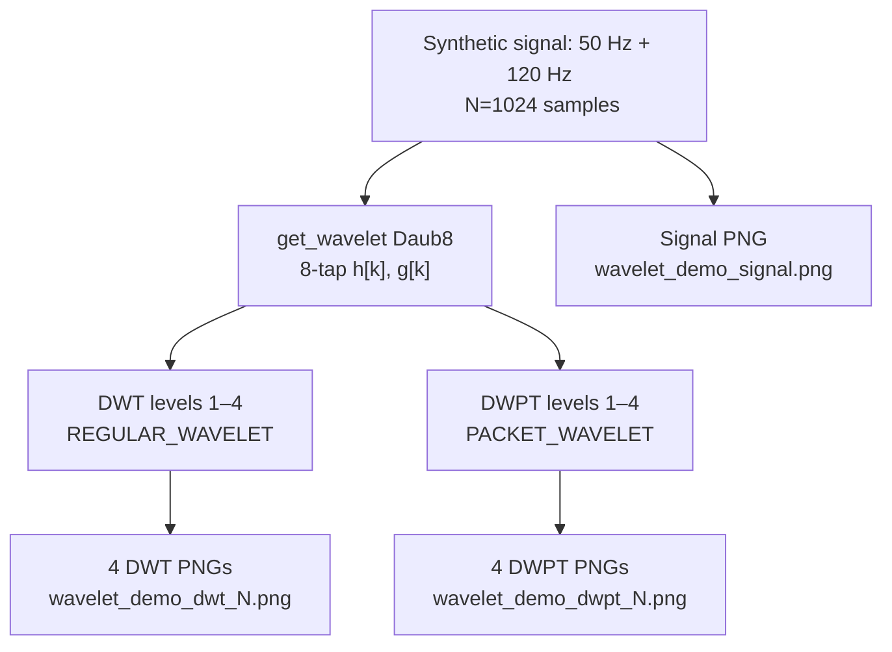

# Wavelet Demo

Demonstrates both Discrete Wavelet Transform (DWT) and Discrete Wavelet Packet Transform (DWPT) applied to a synthetic two-component signal using the Daubechies-8 wavelet. Decomposes the signal across levels 1–4 and saves 9 PNG plots, providing a visual reference for filter bank behaviour and frequency localisation.

---

## Theoretical Background

Wavelet analysis provides simultaneous time-frequency localisation. The Mallat fast wavelet algorithm [Mallat, 1989] computes the multi-resolution analysis (MRA) in $O(N)$ operations via iterated filterbank stages:

$$a_j[n] = \sum_k h[k]\, a_{j-1}[2n-k], \qquad d_j[n] = \sum_k g[k]\, a_{j-1}[2n-k]$$

where $h[k]$ is the low-pass scaling filter and $g[k]$ is the high-pass wavelet filter. The DWT retains only the approximation branch; the DWPT [Coifman & Wickerhauser, 1992] splits both branches at every level, producing $2^j$ subbands at level $j$.

Daubechies-8 (Daub8) has 4 vanishing moments with an 8-tap filter, achieving good frequency selectivity while remaining compact in time.

---

## How It Is Implemented Here

**Source:** `src/demos/cppDemos/wavelet_demo/`

```cpp
// src/demos/cppDemos/wavelet_demo/wavelet_demo.cpp (structure)
auto filter = wavelets::get_wavelet<wavelets::Daub8>();

// DWT: retain approximation only
auto dwt_result = wavelets::malat(signal, filter, REGULAR_WAVELET, level);

// DWPT: split both branches → 2^level subbands
auto dwpt_result = wavelets::malat(signal, filter, PACKET_WAVELET, level);

// Save PNG for each level
MatplotlibCpp::savefig("wavelet_demo_dwt_" + std::to_string(level) + ".png");
```

Signal: $x[n] = 0.7\sin(2\pi \cdot 50 \cdot n/f_s) + 0.3\sin(2\pi \cdot 120 \cdot n/f_s)$, $f_s = 1024\,\text{Hz}$, $T = 1\,\text{s}$.

---

## Data Flow



---

## How to Build and Run

```bash
cd /home/ensismoebius/Repos/doutorado/software/nn
cmake --preset=max-performance
cmake --build out/build/max-performance --target wavelet_demo -j$(nproc)
./out/build/max-performance/src/demos/cppDemos/wavelet_demo/wavelet_demo
```

No arguments. Outputs 9 PNG files in the working directory.

---

## Test Suite

Wavelet transform correctness is tested via the `core_gtest` suite. Run:

```bash
cmake --build out/build/max-performance --target core_gtest -j$(nproc)
ctest --test-dir out/build/max-performance -R Wavelet --output-on-failure
```

---

## Common Pitfalls

1. **Level too high**: at level $j$, each subband has $N / 2^j$ samples. For $N = 1024$ and $j = 10$, subbands have 1 sample each — effectively meaningless. Keep $j \leq \log_2(N) - 3$ to retain at least 8 samples per band.
2. **DWPT memory**: the full DWPT tree at level $j$ has $2^j$ subbands each of length $N / 2^j$, totalling $N$ samples — same as the DWT. However, the tree structure itself requires $O(N \log N)$ intermediate storage if all levels are kept simultaneously.
3. **PNG write requires display (headless)**: `MatplotlibCpp::savefig()` calls Python/matplotlib; on headless servers, set `MPLBACKEND=Agg` before running.

---

## See Also

- [Core/Wavelet](../Core/Wavelet.md) — wavelet library API
- [Demos/wpt-voice-biometrics](./wpt-voice-biometrics.md) — uses DWPT for speaker feature extraction
- [Concepts/LFCC](../Concepts/LFCC.md) — alternative frequency-domain feature approach

---

## References

[1] S. Mallat, "A theory for multiresolution signal decomposition: the wavelet representation," *IEEE Trans. Pattern Anal. Mach. Intell.*, vol. 11, no. 7, pp. 674–693, Jul. 1989.

[2] R. R. Coifman and M. V. Wickerhauser, "Entropy-based algorithms for best basis selection," *IEEE Trans. Inf. Theory*, vol. 38, no. 2, pp. 713–718, Mar. 1992.

[3] I. Daubechies, "Orthonormal bases of compactly supported wavelets," *Commun. Pure Appl. Math.*, vol. 41, pp. 909–996, 1988.
