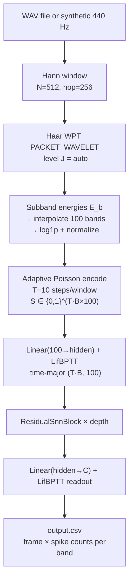

# WPT Voice Biometrics

Full C++ voice biometrics pipeline: loads a WAV file or generates a synthetic 440 Hz tone, applies Wavelet Packet Transform (WPT) subband energy extraction, adaptively Poisson-encodes the energy features into spike trains, and runs them through a residual SNN for speaker feature extraction. Outputs a CSV of spike patterns per frame.

---

## Theoretical Background

The Wavelet Packet Transform [Coifman & Wickerhauser, 1992] extends the DWT by recursively splitting both approximation and detail branches, yielding $2^J$ frequency-uniform subbands at level $J$. For speaker recognition, WPT subband energies capture glottal pulse harmonics at finer resolution than mel filterbanks.

Subband energy extraction:
$$E_b = \frac{1}{|s_b|} \sum_n s_b[n]^2, \qquad \tilde{E}_b = \log(1 + E_b)$$

Adaptive Poisson encoding (identical to `snn_speaker_demo`):
$$r_{\max} = \text{clamp}\!\left(\frac{r_\text{target}}{\bar{E} + \varepsilon},\; 0.02,\; 0.5\right), \quad s_b[t] \sim \text{Bernoulli}(\text{clamp}(\hat{E}_b \cdot r_{\max}, 0, 1))$$

The Haar wavelet is used for its perfect reconstruction, zero phase, and computational simplicity [Haar, 1910].

---

## How It Is Implemented Here

**Source:** `src/demos/cppDemos/wpt_voice_biometrics/`

```cpp
// voice_biometrics_cpp main pipeline
// 1. Hann window: N=512, hop=256
// 2. Haar WPT PACKET_WAVELET, level J = max(floor(log2(N)), ceil(log2(n_bands)))
// 3. Subband energies → interpolate to n_bands=100 → log1p → normalize [0,1]
// 4. Adaptive Poisson encode: T=10 steps/window → {0,1}^(T×B×100)
// 5. Residual SNN: Linear(100→hidden) + LifBPTT
//                  ResidualSnnBlock × depth (depth=-1 → ceil(log2(hidden)))
//                  Linear(hidden→n_classes) + LifBPTT (readout)
// 6. Write CSV: frame_idx, band_0, ..., band_99
```

---

## Data Flow



---

## How to Build and Run

```bash
cd /home/ensismoebius/Repos/doutorado/software/nn
cmake --preset=max-performance
cmake --build out/build/max-performance --target voice_biometrics_cpp -j$(nproc)

# Synthetic signal
./out/build/max-performance/src/demos/cppDemos/wpt_voice_biometrics/voice_biometrics_cpp \
    --saida-csv output.csv

# WAV file input
./out/build/max-performance/src/demos/cppDemos/wpt_voice_biometrics/voice_biometrics_cpp \
    --entrada-wav speaker01.wav \
    --saida-csv features_s01.csv \
    --num-bandas 100 --passos-por-janela 10 --hidden 128
```

**CLI options:** `--entrada-wav`, `--saida-csv`, `--duracao`, `--taxa-amostragem`, `--tamanho-janela`, `--tamanho-passo`, `--num-bandas`, `--passos-por-janela`, `--profundidade`, `--hidden`, `--seed`.

---

## Test Suite

WPT correctness is tested via `core_gtest`:

```bash
cmake --build out/build/max-performance --target core_gtest -j$(nproc)
ctest --test-dir out/build/max-performance -R wavelet --output-on-failure
```

---

## Common Pitfalls

1. **Level selection with small windows**: if `N_window = 512` and `n_bands = 100`, the auto-selected level $J = \lceil \log_2(100) \rceil = 7$ gives $2^7 = 128$ subbands each with $512 / 128 = 4$ samples. Very short subbands give noisy energy estimates. Reduce `n_bands` or increase window size.
2. **Encoding module dependency**: `codificacao.cpp` is shared with `snn_speaker_demo`. If that file is not compiled into this target's CMakeLists, the Poisson encoder will be missing.
3. **`depth = -1` vs explicit depth**: auto depth `ceil(log2(hidden_size))` grows quickly. For `hidden=1024`, auto depth = 10 blocks, which may be too deep for small datasets and cause overfitting.

---

## See Also

- [Demos/wavelet-demo](./wavelet-demo.md) — visualises DWT/DWPT on a simple signal
- [Demos/snn-speaker-demo](./snn-speaker-demo.md) — LFCC-based alternative front-end
- [Concepts/Time-Major-Layout](../Concepts/Time-Major-Layout.md) — SNN input shape convention
- [Core/Wavelet](../Core/Wavelet.md) — wavelet library API

---

## References

[1] R. R. Coifman and M. V. Wickerhauser, "Entropy-based algorithms for best basis selection," *IEEE Trans. Inf. Theory*, vol. 38, no. 2, pp. 713–718, 1992.

[2] A. Haar, "Zur Theorie der orthogonalen Funktionensysteme," *Math. Ann.*, vol. 69, pp. 331–371, 1910.

[3] W. Fang et al., "Incorporating Learnable Membrane Time Constants to Enhance Learning of Spiking Neural Networks," in *Proc. IEEE/CVF ICCV*, 2021, pp. 2661–2671.
