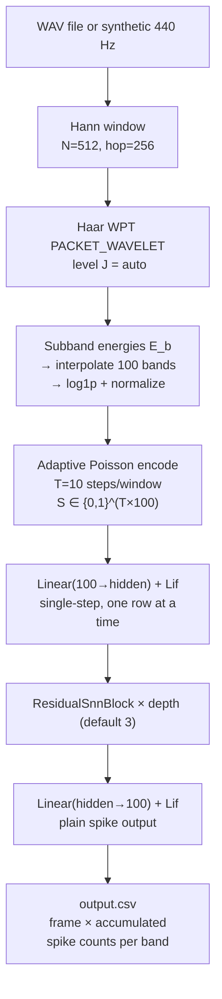

# WPT Voice Biometrics

Full C++ voice biometrics pipeline: loads a WAV file or generates a synthetic 440 Hz tone, applies Wavelet Packet Transform (WPT) subband energy extraction, adaptively Poisson-encodes the energy features into spike trains, and runs them through a residual SNN for speaker feature extraction. Outputs a CSV of spike patterns per frame.

---

## Theoretical Background

The Wavelet Packet Transform [Coifman & Wickerhauser, 1992] extends the DWT by recursively splitting both approximation and detail branches, yielding $2^J$ frequency-uniform subbands at level $J$. For speaker recognition, WPT subband energies capture glottal pulse harmonics at finer resolution than mel filterbanks.

Subband energy extraction:
$$E_b = \frac{1}{|s_b|} \sum_n s_b[n]^2, \qquad \tilde{E}_b = \log(1 + E_b)$$

Adaptive Poisson encoding (identical to `snn_speaker_demo`):
$$r_{\max} = \text{clamp}\!\left(\frac{r_\text{target}}{\bar{E} + \varepsilon},\; 0.02,\; 0.5\right), \quad s_b[t] \sim \text{Bernoulli}(\text{clamp}(\hat{E}_b \cdot r_{\max}, 0, 1))$$

The Haar wavelet is used for its perfect reconstruction, zero phase, and computational simplicity [Haar, 1910].

---

## How It Is Implemented Here

**Source:** `src/demos/cppDemos/wpt_voice_biometrics/`

```cpp
// main.cpp pipeline (run_pipeline())
// 1. Hann window: N=512, hop=256 (compute_wpt_level clamps level, see below)
// 2. Haar WPT PACKET_WAVELET, level J = max(1, min(floor(log2(window_size)),
//    ceil(log2(num_bands))))  — capped by BOTH window size and band count
// 3. Subband energies → interpolate to num_bands=100 → log1p → normalize by max to [0,1]
// 4. Adaptive Poisson encode: T=steps_per_window=10 → {0,1}^(T×num_bands), one frame
//    row-by-row through the model (not a single time-major (T*B,F) call)
// 5. SnnModel (single-step nn::Lif, not LifBPTT):
//    Linear(num_bands→hidden) → Lif
//    ResidualSnnBlock × depth (depth=3 default/CLI, NOT auto-computed from hidden)
//      each block: Linear(hidden→hidden)→Lif→Linear(hidden→hidden)→Lif, + skip(x)
//    Linear(hidden→num_bands) → Lif  (plain spike output, no BPTT/readout mode)
// 6. Write CSV: frame, band_0, ..., band_(num_bands-1)  — accumulated spike counts per band
```

---

## Data Flow



---

## How to Build and Run

```bash
cd /home/ensismoebius/Repos/doutorado/software/nn
cmake --preset=max-performance
cmake --build out/build/max-performance --target voice_biometrics_cpp -j$(nproc)

# Synthetic signal
./out/build/max-performance/src/demos/cppDemos/wpt_voice_biometrics/voice_biometrics_cpp \
    --saida-csv output.csv

# WAV file input
./out/build/max-performance/src/demos/cppDemos/wpt_voice_biometrics/voice_biometrics_cpp \
    --entrada-wav speaker01.wav \
    --saida-csv features_s01.csv \
    --num-bandas 100 --passos-por-janela 10 --hidden 128
```

**CLI options:** `--entrada-wav`, `--saida-csv`, `--duracao`, `--taxa-amostragem`, `--tamanho-janela`, `--tamanho-passo`, `--num-bandas`, `--passos-por-janela`, `--profundidade`, `--hidden`, `--seed`.

---

## Test Suite

The demo has its own gtest target (`WptVoiceBioTest` fixture plus free `TEST`s —
`compute_wpt_level`, Hann window shape, `apply_windowing`, `interpolate_to_size`,
WPT energy finiteness/non-negativity, `preprocess_energy` normalization, Poisson
encoding binariness):

```bash
cmake --build out/build/max-performance --target wpt_voice_biometrics_gtest -j$(nproc)
ctest --test-dir out/build/max-performance -R "WptVoiceBioTest|WptLevel|HannWindow|InterpolateToSize|PreprocessEnergy" --output-on-failure
```

---

## Common Pitfalls

1. **Level selection is `min`, not `max`, of the two bounds**: `compute_wpt_level()` returns `max(1, min(floor(log2(window_size)), ceil(log2(num_bands))))` — the level is capped by *both* the window size and the requested band count, never exceeding either. With defaults `N_window = 512` and `n_bands = 100`: `floor(log2(512))=9`, `ceil(log2(100))=7`, so `min(9,7)=7`, giving $2^7 = 128$ subbands of $512/128 = 4$ samples each — short subbands give noisy energy estimates. Reduce `--num-bandas` or increase `--tamanho-janela`.
2. **Encoding module dependency**: `codificacao.cpp` (from `snn_speaker_demo`) is compiled directly into this target's `CMakeLists.txt` (`../snn_speaker_demo/codificacao.cpp`) — if that relative path changes, the Poisson encoder symbols will be missing at link time.
3. **`--profundidade` (depth) defaults to 3, not auto-computed**: there is no `depth=-1` special case in `main.cpp` — `SnnConfig::depth` defaults to 3 and is passed straight to `SnnModel`'s residual-block loop. Passing a large `--profundidade` builds that many `ResidualSnnBlock`s directly; nothing derives it from `--hidden`.

---

## See Also

- [Demos/wavelet-demo](./wavelet-demo.md) — visualises DWT/DWPT on a simple signal
- [Demos/snn-speaker-demo](./snn-speaker-demo.md) — LFCC-based alternative front-end
- [Concepts/Time-Major-Layout](../Concepts/Time-Major-Layout.md) — SNN input shape convention
- [Core/Wavelet](../Core/Wavelet.md) — wavelet library API

---

## References

[1] R. R. Coifman and M. V. Wickerhauser, "Entropy-based algorithms for best basis selection," *IEEE Trans. Inf. Theory*, vol. 38, no. 2, pp. 713–718, 1992.

[2] A. Haar, "Zur Theorie der orthogonalen Funktionensysteme," *Math. Ann.*, vol. 69, pp. 331–371, 1910.

[3] W. Fang et al., "Incorporating Learnable Membrane Time Constants to Enhance Learning of Spiking Neural Networks," in *Proc. IEEE/CVF ICCV*, 2021, pp. 2661–2671.
