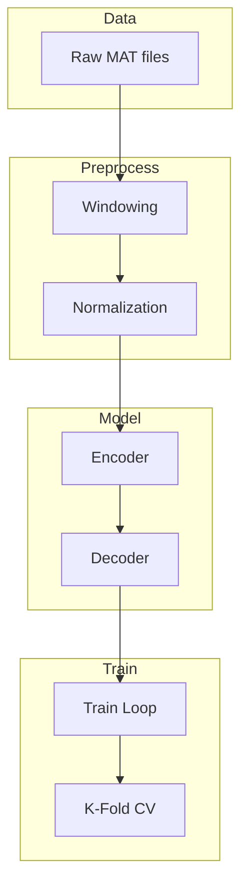

# AutoencoderRunner: Autoencoder Experiments

AutoencoderRunner implements and evaluates autoencoder architectures for multimodal (EEG + audio) feature learning on the 10.1117 imagined speech dataset.

## Theoretical Background

### Multimodal Learning

Combining EEG and audio signals leverages complementary information:
- **EEG**: Captures neural correlates of imagined speech
- **Audio**: Captures acoustic properties of speech

### Autoencoder Variants

AutoencoderRunner implements three autoencoder architectures:
1. **Audio-Only**: Compresses audio features
2. **EEG-Only**: Compresses EEG features  
3. **Fused**: Jointly encodes both modalities before bottleneck

## Implementation

### Dataset

```cpp
// File: include/data_loaders/10.1117/datasets/windowed/FusedWindowDataset.hpp
class FusedWindowDataset : public Dataset
{
public:
    explicit FusedWindowDataset(std::vector<SubjectFiles> subjects,
        nn::windowing::WindowSpec eeg_spec,
        nn::windowing::WindowSpec audio_spec);

    [[nodiscard]] auto size() const -> std::size_t override;
    [[nodiscard]] auto get_item(std::size_t idx) const -> Batch override;
    void collate_into(const std::vector<std::size_t>& indices, Batch& batch) const override;

    [[nodiscard]] auto eeg_spec() const noexcept -> const nn::windowing::WindowSpec&;
    [[nodiscard]] auto audio_spec() const noexcept -> const nn::windowing::WindowSpec&;
    [[nodiscard]] auto windows_per_pair() const noexcept -> int;
    [[nodiscard]] auto input_features() const noexcept -> int;
};
```

### Configuration

The real struct is named `Config` (not `AutoencoderRunnerConfig`), field
names are prefixed by area, and the model/dataset "type" selectors are
enums (`AutoencoderRunnerAutoencoderType`, `AutoencoderRunnerDatasetType`),
not free-form strings:

```cpp
// File: src/experiments/autoencoderRunner/lib/include/AutoencoderRunnerConfig.hpp
struct Config
{
    std::string profile_name;
    std::string dataset_root_path;

    AutoencoderRunnerDatasetType dataset_type;
    AutoencoderRunnerAutoencoderType autoencoder_type;  // not "audio"/"eeg"/"fused" strings

    int autoencoder_hidden_size;
    int autoencoder_latent_size;
    int autoencoder_depth;

    size_t training_batch_size;
    size_t training_epochs;
    float training_learning_rate;
    std::string training_loss_type;  // "mse" | "mae"

    // K-fold cross-validation
    bool kfold_enabled;
    size_t kfold_n_splits;
    bool kfold_shuffle;
    std::optional<unsigned int> kfold_seed;
};
```

### Training Pipeline



## Results Format

There is no literal JSON template — `ResultsWriter.hpp` defines a C++
`Summary` struct that `write_run_summary_json()` serializes. Real field
names (per-fold results are parallel arrays indexed `[fold_idx][epoch_idx]`,
not a `fold_results` array of per-fold objects):

```cpp
// File: src/experiments/autoencoderRunner/lib/include/ResultsWriter.hpp
namespace autoencoderRunner
{
struct Summary
{
    std::string profile_name;
    std::string dataset_type;
    std::string autoencoder_type;
    std::string optimizer_type;
    std::string loss_type;
    float optimizer_learning_rate = 0.0F;

    std::size_t kfold_n_splits = 0;
    // Per-fold, per-epoch validation mean reconstruction losses: [fold_idx][epoch_idx]
    std::vector<std::vector<float>> fold_epoch_val_losses;
    std::vector<float> fold_mean_val_losses;   // mean per fold
    float mean_val_loss = 0.0F;                // grand mean across folds

    float test_loss = 0.0F;
    std::size_t test_samples = 0;
    int exit_code = 0;
    std::string error_message;
};

auto write_run_summary_json(const Summary& summary, std::string& out_path, std::string& out_error)
    -> bool;
}
```

## Usage

```bash
# Run experiment (profile-only launcher; profile is a JSON file stem
# resolved from src/experiments/autoencoderRunner/profiles/)
./autoencoderRunner --profile default

# Results written to:
# results/<timestamp>_<profile_stem>.json
```

## How Experiment04 Differs in Practice

Although the [Experiment04](../Experiments/Guayaquil.md) page frames it as an LSTM autoencoder experiment, the current implementation is a comparative benchmark runner that orchestrates both LSTM and SNN autoencoder families.

From code:

- Entry point `src/experiments/guayaquil/guayaquil.cpp` is intentionally thin: `main()` calls `guayaquil::run_comparative_experiment(argc, argv)` directly (declared in `GuayaquilRunner.hpp`, defined in `src/experiments/guayaquil/lib/src/GuayaquilExperiment.cpp`). `LstmAutoencoderExperiment` (`GuayaquilLstmAutoencoder.hpp`) declares a `run()` method but has no `.cpp` implementation or caller anywhere in the tree — it is unused, not the entry path.
- Default profile stem is `lstm-compare`, resolved from `src/experiments/guayaquil/profiles/`.
- Comparative sweep includes datasets (e.g., `fsdd`, `physionet`), encoding strategies (`direct`, `poisson`, `latency`), SNN architecture variants (`dense`, `conv1d`, `recurrent`), and hyperparameter grids (`layers`, `v_th`, `alpha`).
- Training uses Adam + MSE with early stopping; evaluation reports MSE, MAE, $R^2$, precision/recall/F1, spike rate, latency, parameter count, and MAC estimates.
- Output artifacts are written as:
    - `<run_tag>_comparative_metrics.csv`
    - `<run_tag>_publication_table.csv`
    - `<run_tag>_summary.json`

This distinction matters when comparing AutoencoderRunner and Experiment04 outputs: AutoencoderRunner is a multimodal autoencoder pipeline, while Experiment04 currently serves as a deterministic SNN-vs-LSTM comparative harness.

## Common Pitfalls

1. **Modality Mismatch**: Ensure EEG and audio feature dimensions are correctly specified

2. **Window Alignment**: EEG and audio windows must be time-aligned

3. **Normalization**: Fit normalizers on training data only; apply to test separately

## See Also

- [Autoencoders](../Concepts/Autoencoders.md) - Theory
- [Experiment04](../Experiments/Guayaquil.md) - LSTM autoencoder variant
- [DataLoaders](../Core/DataLoaders.md) - Dataset loading
- [K-Fold Cross-Validation](../Concepts/K-Fold-Cross-Validation.md) - Validation strategy

## References

[1] F. Lotte, L. Bougrain, A. Cichocki, M. Clerc, M. Congedo, A. Rakotomamonjy, and F. Yger, "A review of classification algorithms for EEG-based brain-computer interfaces: A 10-year update," *J. Neural Eng.*, vol. 15, no. 3, p. 031005, 2018. [Online]. Available: https://doi.org/10.1088/1741-2552/aab2f2

[2] L. Aristimunha et al., "Mother of all BCI benchmarks," in *Advances in Neural Information Processing Systems (NeurIPS)*, 2023. [Online]. Available: https://doi.org/10.48550/arXiv.2312.12111
