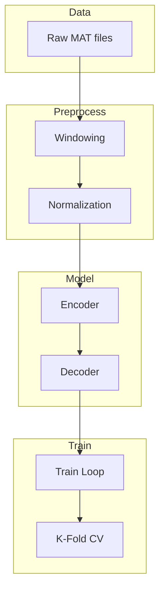

# Experiment03: Autoencoder Experiments

Experiment03 implements and evaluates autoencoder architectures for multimodal (EEG + audio) feature learning on the 10.1117 imagined speech dataset.

## Theoretical Background

### Multimodal Learning

Combining EEG and audio signals leverages complementary information:
- **EEG**: Captures neural correlates of imagined speech
- **Audio**: Captures acoustic properties of speech

### Autoencoder Variants

Experiment03 implements three autoencoder architectures:
1. **Audio-Only**: Compresses audio features
2. **EEG-Only**: Compresses EEG features  
3. **Fused**: Jointly encodes both modalities before bottleneck

## Implementation

### Dataset

```cpp
// File: include/data_loaders/10.1117/datasets/windowed/FusedWindowDataset.hpp
class FusedWindowDataset : public Dataset
{
    EEGWindowDataset eeg_;
    AudioWindowDataset audio_;

public:
    // Loads windowed EEG and audio data from MAT files
    // Aligns by trial and window index
};
```

### Configuration

```cpp
// File: src/experiments/03/lib/include/Experiment03Config.hpp
struct Experiment03Config
{
    // Model
    std::string model_type;  // "audio", "eeg", "fused"
    int input_features;
    int hidden_size = 64;
    int latent_size = 32;
    int depth = 2;

    // Training
    int epochs = 100;
    int batch_size = 32;
    float learning_rate = 0.001f;
    int k_folds = 5;

    // Dataset
    std::string data_path;
    std::vector<int> subject_ids;
};
```

### Training Pipeline



## Results Format

```json
// File: src/experiments/03/lib/include/ResultsWriter.hpp
{
    "experiment": "Experiment03",
    "timestamp": "2024-01-15T10:30:00Z",
    "config": {
        "model_type": "fused",
        "latent_size": 32,
        "learning_rate": 0.001
    },
    "fold_results": [
        {
            "fold": 0,
            "train_loss": 0.023,
            "val_loss": 0.031,
            "epochs": 100
        }
    ],
    "test_loss": 0.028,
    "test_samples": 500
}
```

## Usage

```bash
# Run experiment
./experiment03 --config configs/experiment03.yaml

# Results written to:
# results/experiment03/<timestamp>/
#   - results.json
#   - models/
#   - profiles/
```

## How Experiment04 Differs in Practice

Although the [Experiment04](../Experiments/Experiment04.md) page frames it as an LSTM autoencoder experiment, the current implementation is a comparative benchmark runner that orchestrates both LSTM and SNN autoencoder families.

From code:

- Entry point `src/experiments/04/experiment04.cpp` is intentionally thin and forwards control to `LstmAutoencoderExperiment::run(...)`.
- `LstmAutoencoderExperiment::run(...)` normalizes CLI aliases and delegates to comparative mode (`run_comparative_experiment`) in `src/experiments/04/lib/src/comparative_experiment.cpp`.
- Default profile stem is `lstm-compare`, resolved from `src/experiments/04/profiles/`.
- Comparative sweep includes datasets (e.g., `fsdd`, `physionet`), encoding strategies (`direct`, `poisson`, `latency`), SNN architecture variants (`dense`, `conv1d`, `recurrent`), and hyperparameter grids (`layers`, `v_th`, `alpha`).
- Training uses Adam + MSE with early stopping; evaluation reports MSE, MAE, $R^2$, precision/recall/F1, spike rate, latency, parameter count, and MAC estimates.
- Output artifacts are written as:
    - `<run_tag>_comparative_metrics.csv`
    - `<run_tag>_publication_table.csv`
    - `<run_tag>_summary.json`

This distinction matters when comparing Experiment03 and Experiment04 outputs: Experiment03 is a multimodal autoencoder pipeline, while Experiment04 currently serves as a deterministic SNN-vs-LSTM comparative harness.

## Common Pitfalls

1. **Modality Mismatch**: Ensure EEG and audio feature dimensions are correctly specified

2. **Window Alignment**: EEG and audio windows must be time-aligned

3. **Normalization**: Fit normalizers on training data only; apply to test separately

## See Also

- [Autoencoders](../Concepts/Autoencoders.md) - Theory
- [Experiment04](../Experiments/Experiment04.md) - LSTM autoencoder variant
- [DataLoaders](../Core/DataLoaders.md) - Dataset loading
- [K-Fold Cross-Validation](../Concepts/K-Fold-Cross-Validation.md) - Validation strategy

## References

[1] F. Lotte, L. Bougrain, A. Cichocki, M. Clerc, M. Congedo, A. Rakotomamonjy, and F. Yger, "A review of classification algorithms for EEG-based brain-computer interfaces: A 10-year update," *J. Neural Eng.*, vol. 15, no. 3, p. 031005, 2018. [Online]. Available: https://doi.org/10.1088/1741-2552/aab2f2

[2] L. Aristimunha et al., "Mother of all BCI benchmarks," in *Advances in Neural Information Processing Systems (NeurIPS)*, 2023. [Online]. Available: https://doi.org/10.48550/arXiv.2312.12111
