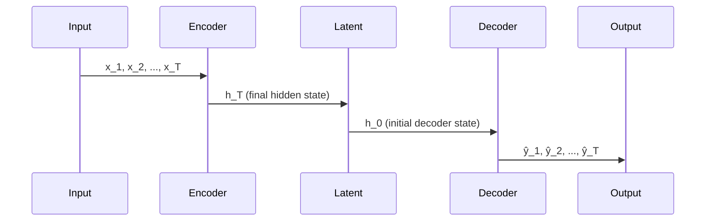

# Experiment04: LSTM Autoencoder

Experiment04 implements LSTM-based autoencoders for sequence-to-sequence learning on time-series data.

## Theoretical Background

### Sequence-to-Sequence Learning

LSTM autoencoders compress variable-length sequences into fixed-size latent vectors:

1. **Encoder LSTM**: Processes input sequence, produces final hidden state
2. **Latent Space**: Fixed-dimensional representation of entire sequence
3. **Decoder LSTM**: Reconstructs sequence from latent state

### BPTT in Autoencoders

Backpropagation Through Time (BPTT) computes gradients across time steps [1]:

1. Forward pass: Encode sequence, store all hidden states
2. Decode: Generate reconstruction, store decoder states
3. Backward pass: Propagate gradients back through decoder, then encoder

## Implementation

### LSTM Autoencoder Architecture

```cpp
// File: src/experiments/04/lib/include/LSTMAutoencoder.hpp
template <typename Backend>
class LSTMAutoencoder : public Module<Backend>
{
    LeakyBPTT encoder_;  // Input -> Latent
    LeakyBPTT decoder_;  // Latent -> Output
    int latent_size_;

public:
    auto forward(const Tensor& input_sequence, bool requires_grad) -> Tensor override
    {
        // Encode: sequence -> latent vector
        Tensor latent = encoder_.forward_sequence(input_sequence, requires_grad);

        // Decode: latent -> reconstruction
        Tensor reconstruction = decoder_.forward_sequence(latent, requires_grad);

        return reconstruction;
    }
};
```

### Training Configuration

```cpp
// File: src/experiments/04/lib/include/Experiment04Config.hpp
struct Experiment04Config
{
    int input_timesteps;    // e.g., 100
    int input_features;     // e.g., 64 per timestep
    int hidden_size = 128;
    int latent_size = 32;
    int num_layers = 2;

    int epochs = 100;
    int batch_size = 16;
    float learning_rate = 0.001f;

    bool use_bidirectional = false;
};
```

### Data Flow



## Usage

```bash
# Run LSTM autoencoder experiment
./experiment04 --config configs/experiment04.yaml

# Outputs:
# - Latent representations
# - Reconstruction quality metrics
# - Per-sequence embeddings
```

## Key Differences from Experiment03

| Feature | Experiment03 | Experiment04 |
|---------|-------------|--------------|
| Model | Feedforward AE | LSTM AE |
| Input | Fixed-dim vectors | Variable-length sequences |
| Latent | Vector | Final hidden state |
| BPTT | Not used | Used |

## Common Pitfalls

1. **Sequence Truncation**: Very long sequences may need truncation

2. **Hidden State Reset**: Ensure proper initialization between sequences

3. **Bidirectional**: Can't be used for online streaming inference

## See Also

- [LSTM and BPTT](../Concepts/LSTM-and-BPTT.md) - Theory
- [Autoencoders](../Concepts/Autoencoders.md) - General autoencoder theory
- [Experiment03](../Experiments/Experiment03.md) - Feedforward autoencoder

## References

[1] S. Hochreiter and J. Schmidhuber, "Long short-term memory," *Neural Computation*, vol. 9, no. 8, pp. 1735–1780, Nov. 1997. [Online]. Available: https://doi.org/10.1162/neco.1997.9.8.1735

[2] A. Graves, "Generating sequences with recurrent neural networks," arXiv preprint arXiv:1308.0850, 2013. [Online]. Available: https://arxiv.org/abs/1308.0850
