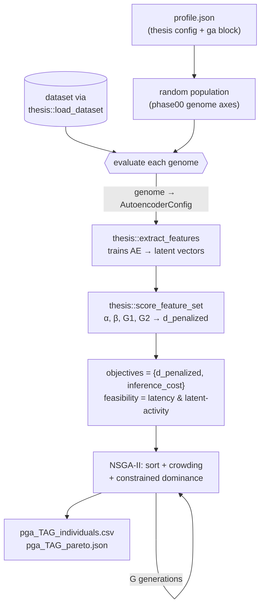

# paraconsistentGA: NSGA-II Autoencoder Architecture Search

`paraconsistentGA` evolves autoencoder feature extractors with a multi-objective genetic
algorithm, ranking each candidate by **paraconsistent feature quality** (`d_penalized`) and
**inference cost** under a hard **latency constraint**. It searches the same architecture
axes the [Thesis](Thesis.md) phase00 grid varied, but with [NSGA-II](../Concepts/Multi-Objective-Optimisation.md)
instead of a fixed sweep — so its Pareto front is directly comparable to the phase00
baseline. Build target `paraconsistentGA`. Design spec: `ga.md` (repo root) +
`src/experiments/paraconsistentGA/PHASE0.md`.

## Theoretical Background

Two ideas meet here. The first is **paraconsistent feature evaluation** [1], the thesis's
novel selection metric: a feature set is scored by its penalised distance to the *Truth*
vertex of the paraconsistent plane, $D_\text{pen} = D_{1,0} + \lambda|G_2|$ with
$\lambda = 2-\sqrt2$, which ranks a class-separating feature set near 0 and a collapsed
("dead-latent") one at exactly 2 — see [Paraconsistent Logic](../Core/Paraconsistent.md).
The second is **NSGA-II** [2], the elitist non-dominated-sorting genetic algorithm that
returns the whole Pareto front of a two-objective search rather than one weighted winner,
with hard constraints handled by Deb's *constrained domination* [3] (a feasible individual
always dominates an infeasible one). The experiment is the composition: NSGA-II searches
autoencoder genomes, each scored by `d_penalized`.

Why a search at all? Phase00 compared 24 hand-picked autoencoder profiles against
handcrafted features and the handcrafted extractor won on `d_penalized` in both modalities.
paraconsistentGA asks whether a *better* autoencoder architecture exists than those hand-picked
tiers, exploring the same axes automatically.

## How It Is Implemented Here

The experiment is deliberately thin: it **reuses** the thesis pipeline and adds only the
genetic algorithm. A genome maps to a `thesis::ThesisConfig::AutoencoderConfig`, which the
existing `thesis::extract_features` trains and turns into latent vectors, which
`thesis::score_feature_set` ranks.

| Concern | Symbol | Source |
|---------|--------|--------|
| Dataset load | `thesis::load_dataset` | `thesis_lib` |
| AE train + latent extraction | `thesis::extract_features` | `thesis_lib` (Protocol ANN-AE / SNN-AE) |
| `d_penalized` scoring | `thesis::score_feature_set` | `thesis_lib` ([Paraconsistent Logic](../Core/Paraconsistent.md)) |
| Config schema | `thesis::ThesisConfig::from_json` | embedded + a `ga` block |
| **NSGA-II (new)** | `pga::run_nsga2` | `GaNsga2.cpp` |

The fitness wrapper is the whole reuse story:

```cpp
// src/experiments/paraconsistentGA/lib/src/GaFitness.cpp (abridged)
const auto fe = make_feature_extraction(g, cfg);            // genome → AutoencoderConfig
for (int s = 0; s < cfg.ga.n_seeds; ++s) {
    const auto sets = thesis::extract_features(view, fe, cfg.base.training,
                                               modality, fusion_mode, seed);   // trains AE
    for (const auto& fs : sets)
        d_pen = thesis::score_feature_set(view.samples, fs).d_penalized;       // ranks latents
}
```

The genome carries a **free architecture** — there are no pre-defined layer tiers. Its
`encoder_widths` is an arbitrary-length list of strictly-decreasing neuron counts: layer
count and per-layer width both come from the DNA, the last element is the latent
bottleneck, and the decoder mirrors it (`{10,5,4,2}` → 256→10→5→4→2, decoder 2→4→5→10→256).
The only structural invariant is strict decrease (each layer compresses — the definition of
an autoencoder), enforced by `repair_widths`. The remaining genes (SNN only) are `encoding`
∈ {direct, latency, poisson} with `time_steps`/`voltage_threshold` coupled to it. `model`
and `modality` are fixed per run (population-defining), so one `--config` evolves one
population. Bounds (`min_layers`, `max_layers`, `min_width`, `max_width`) keep the search
finite; with the shipped 1–6 layers over widths 1–128 the space is ~5.7×10⁹ architectures,
so the GA is a genuine search rather than a disguised enumeration.

For the free per-layer widths to reach the network, `ThesisFeatureExtraction` forwards the
full `encoder_layer_spec`/`decoder_layer_spec` to the AE config so the builder honours each
width exactly; without that forwarding the builder falls back to a uniform-width taper and
the genome's per-layer counts are silently lost (guarded by `thesis_freearch_gtest`).

**Objectives (both minimised)** are `d_penalized_mean` (over `n_seeds`, with std recorded)
and a structural `inference_cost` proxy (encoder MACs × `time_steps`). **Constraints** are an
estimated end-to-end latency ≤ ceiling and a latent-activity ≥ `tau_rec` guard (the §3.3
reconstruction sanity filter, realised as a latent-collapse detector — see `PHASE0.md`).

## Data Flow



## Usage Example

```bash
cd software/nn
cmake --build out/build/max-performance --target paraconsistentGA -j$(nproc)

# One population per (model, modality). SNN/EEG shown; also pga_ann_eeg.json.
./out/build/max-performance/src/experiments/paraconsistentGA/paraconsistentGA \
  --config out/build/max-performance/src/experiments/paraconsistentGA/profiles/pga_snn_eeg.json
```

Outputs (`results/paraconsistentGA/`): `pga_{tag}_individuals.csv` — per-genome log with
α, β, G1, G2, d_truth, d_penalized mean/std, latent_activity, param_count, inference_cost,
est_latency_ms and feasibility (ga.md §6) — and `pga_{tag}_pareto.json`, the final feasible
front plus run metadata. The JSON carries an explicit UNCALIBRATED-latency warning until the
latency proxy is calibrated on real target hardware.

Unit tests: `paraconsistent_ga_gtest` (NSGA-II dominance/crowding/sort, `d_penalized`
reference cases `(1,1)→2.0` and `(0.92,0.075)→0.1580`, constant-output-ranked-worst, genome
mapping, config validation).

## Common Pitfalls

1. **Treating the latency numbers as real.** No target hardware is confirmed for the thesis
   (ga.md §4); `ns_per_mac` and `fixed_pipeline_cost_ms` are estimates. Every Pareto JSON is
   flagged UNCALIBRATED — calibrate before quoting milliseconds.
2. **Reading `latent_activity` as reconstruction error.** It is a latent-collapse proxy, not
   decoder MSE (the reused `extract_features` returns latents only). It faithfully detects the
   α=β=1 degeneracy but is not a reconstruction metric.
3. **Expecting Van Rossum / Victor–Purpura spike metrics.** Not implemented; the SNN-AE trains
   under MSE. Listed as future work (ga.md §5.2).
4. **Comparing ANN and SNN reconstruction/latent values across populations.** `d_penalized` is
   comparable across technologies; `tau_rec` and latent activity are not — keep per-population.
5. **Mixing modalities in one run.** `model` and `modality` are fixed per profile; run separate
   configs for eeg / voice / fused (ga.md §5.3/§5.4).

## See Also

- [Multi-Objective Optimisation (NSGA-II)](../Concepts/Multi-Objective-Optimisation.md) — the search algorithm
- [Paraconsistent Logic](../Core/Paraconsistent.md) — the `d_penalized` objective
- [Autoencoders](../Concepts/Autoencoders.md) — what each genome builds
- [AutoencoderRunner](AutoencoderRunner.md) — the ANN-AE / SNN-AE networks reused here
- [Thesis](Thesis.md) — phase00 baseline this search extends
- [Spike Encoding](../Concepts/Spike-Encoding.md) — the SNN `encoding` gene (direct/latency/poisson)

## References

[1] R. C. Guido et al., "Paraconsistent feature engineering for EEG-based imagined speech classification," *Proceedings of SPIE*, vol. 10160, 2017. [Online]. Available: https://doi.org/10.1117/12.2255697 — with N. C. A. da Costa, "On the theory of inconsistent formal systems," *Notre Dame Journal of Formal Logic*, vol. 15, no. 4, pp. 497–510, 1974, for the underlying logic. See [Paraconsistent Logic](../Core/Paraconsistent.md) for the $\lambda = 2-\sqrt2$ contradiction-penalty derivation.

[2] K. Deb, A. Pratap, S. Agarwal, and T. Meyarivan, "A fast and elitist multiobjective genetic algorithm: NSGA-II," *IEEE Transactions on Evolutionary Computation*, vol. 6, no. 2, pp. 182–197, Apr. 2002. [Online]. Available: https://doi.org/10.1109/4235.996017

[3] K. Deb, "An efficient constraint handling method for genetic algorithms," *Computer Methods in Applied Mechanics and Engineering*, vol. 186, no. 2–4, pp. 311–338, 2000. [Online]. Available: https://doi.org/10.1016/S0045-7825(99)00389-8
