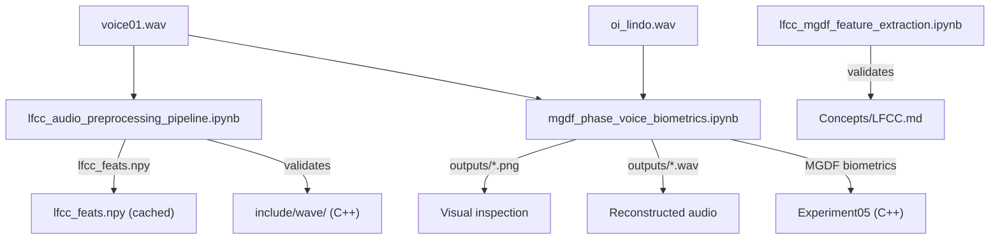

# Jupyter Notebooks — Prototyping and Exploration

Python Jupyter notebooks used for rapid prototyping, algorithm validation, and visual exploration before C++ implementation. Located at `notebooks/` in the repository root (three levels above `software/nn/`).

## Theoretical Background

Notebooks serve as executable scratch-pads that validate signal-processing theory before it is hardened into the C++ framework. Three domains are covered:

**Audio / speech features** — Linear Frequency Cepstral Coefficients (LFCC) and Modified Group Delay Function (MGDF) are computed from scratch to verify the filterbank + DCT pipeline [Davis & Mermelstein, 1980] and the group-delay-based spectral representation [Murty & Yegnanarayana, 2011].

**Neural-network math** — Activation functions, their derivatives, and single-neuron gradient descent are visualised interactively to build intuition for the backpropagation chain used throughout the C++ layers [Rumelhart et al., 1986].

**EEG reference** — The International 10–20 electrode placement diagram is kept alongside the preprocessing pipeline as a spatial reference [Jasper, 1958].

## Directory Layout

```
notebooks/
├── audio/                          ← signal-processing prototypes
│   ├── lfcc_audio_preprocessing_pipeline.ipynb
│   ├── lfcc_mgdf_feature_extraction.ipynb
│   ├── mgdf_phase_voice_biometrics.ipynb
│   ├── lfcc_feats.npy              ← cached LFCC features (output of pipeline nb)
│   ├── voice01.wav                 ← sample utterance 1
│   ├── oi_lindo.wav                ← sample utterance 2
│   └── outputs/                   ← generated PNG + WAV artifacts
│       ├── gd_mgdf_images.png
│       ├── magnitude_and_phase_slice.png
│       ├── mgdf_gd_slices.png
│       └── voz1_*.wav / voz2_*.wav
│
├── eeg/
│   └── 21_electrodes_of_International_10-20_system_for_EEG.png
│
└── ml/                             ← neural-network math visualisations
    ├── activation_functions_derivative_interactive.ipynb
    ├── sigmoid_weights_interactive_test.ipynb
    ├── single_neuron_sigmoid_training.ipynb
    └── tangent_lines_derivative_visualization.ipynb
```

## Notebook Descriptions

### audio/

| Notebook | Purpose |
|---|---|
| `lfcc_audio_preprocessing_pipeline.ipynb` | Full LFCC pipeline: pre-emphasis → framing → power spectrum → linear filterbank → log → DCT → delta/delta-delta. Saves `lfcc_feats.npy`. Validates the same pipeline in `include/wave/`. |
| `lfcc_mgdf_feature_extraction.ipynb` | Implements LFCC and MGDF from first principles (no librosa). Verifies the linear filterbank shape `(F, n_filters)` and the DCT matrix. Unresolved shape bug in `dct_type2` documented in cell output. |
| `mgdf_phase_voice_biometrics.ipynb` | Two-part notebook. **Part 1**: compares magnitude, wrapped/unwrapped phase, group delay, and MGDF on two voice signals; saves PNGs and WAVs to `outputs/`. **Part 2**: MGDF + mel-pooling → LogisticRegression speaker biometrics pipeline with ROC/AUC/EER. Validates the MGDF approach before any C++ port. |

### eeg/

| File | Purpose |
|---|---|
| `21_electrodes_of_International_10-20_system_for_EEG.png` | Reference diagram for the standard 10–20 EEG electrode placement system. Used for sanity-checking channel ordering in the `10.1117/` dataset loader. |

### ml/

| Notebook | Purpose |
|---|---|
| `activation_functions_derivative_interactive.ipynb` | Interactive slider over activation functions (sigmoid, ReLU, tanh, leaky ReLU, softplus, SiLU) and their derivatives. Plots tangent line at chosen x. 3-D surface of `f(x,y) = x²+y²` with rotation control. |
| `sigmoid_weights_interactive_test.ipynb` | Matrix `imshow` sanity check + interactive sigmoid output as a function of two weights w₁, w₂. |
| `single_neuron_sigmoid_training.ipynb` | Single neuron (one sigmoid unit, two inputs) trained via gradient descent for 10⁸ steps. Demonstrates weight divergence when one input is zero — only w₁ learns. |
| `tangent_lines_derivative_visualization.ipynb` | Plots all tangent lines to `f(x) = x²` over `[−π, π]`. Visual proof that the envelope of tangents is the parabola itself. |

## Data Flow



## Usage Example

```python
# Run lfcc_audio_preprocessing_pipeline.ipynb from notebooks/audio/
# Requires: pip install numpy scipy soundfile matplotlib

# Key configuration cells:
FS_TARGET = 44100
FRAME_MS  = 25.0      # 25 ms window
FFT_SIZE  = 512
N_FILTERS = 24        # linear filterbank bands
N_CEPS    = 19        # cepstral coefficients retained

# After running all cells, features are saved:
import numpy as np
feats = np.load("lfcc_feats.npy")  # shape: (n_frames, 57) = 19 + 19Δ + 19ΔΔ
```

## Common Pitfalls

1. **Relative paths to WAV files** — All audio notebooks expect `voice01.wav` and `oi_lindo.wav` in the same directory (`notebooks/audio/`). Running from a different working directory causes `FileNotFoundError`. Always launch Jupyter with the kernel cwd set to `notebooks/audio/`.

2. **DCT matrix shape bug in `lfcc_mgdf_feature_extraction.ipynb`** — The `dct_type2` function builds a `(N, 1)` matrix `k` and multiplies against a `(N,)` vector, causing a `ValueError: shapes (32,1) and (32,) not aligned`. The pipeline notebook uses `scipy.fftpack.dct` instead and is bug-free.

3. **`mgdf_phase_voice_biometrics.ipynb` Part 2 needs speaker folders** — The biometrics section expects either `speakerA/` + `speakerB/` directories, or `voz1.wav` + `voz2.wav`. The supplied samples (`voice01.wav`, `oi_lindo.wav`) are named differently — rename or update `INPUT_A`/`INPUT_B` constants before running Part 2.

4. **`ipympl` widget backend** — `ml/` notebooks use `%matplotlib widget` which requires `ipympl`. Install with `pip install ipympl` and restart the kernel if plots are blank.

## See Also

- [Concepts/LFCC](./Concepts/LFCC.md) — C++ LFCC theory and implementation
- [Core/Wave](./Core/Wave.md) — WAV I/O and filterbank in C++
- [Concepts/Imagined-Speech-and-EEG](./Concepts/Imagined-Speech-and-EEG.md) — EEG context for the electrode diagram
- [Research-Context](./Research-Context.md) — Where MGDF/LFCC fit in the thesis pipeline
- [Experiments/Experiment05](./Experiments/Thesis.md) — Primary thesis experiment using these features

## References

[Davis & Mermelstein, 1980] S. B. Davis and P. Mermelstein, "Comparison of parametric representations for monosyllabic word recognition in continuously spoken sentences," *IEEE Trans. Acoust., Speech, Signal Process.*, vol. 28, no. 4, pp. 357–366, Aug. 1980.

[Murty & Yegnanarayana, 2011] K. S. R. Murty and B. Yegnanarayana, "Epoch extraction from speech signals," *IEEE Trans. Audio, Speech, Lang. Process.*, vol. 16, no. 8, pp. 1602–1613, Nov. 2008.

[Rumelhart et al., 1986] D. E. Rumelhart, G. E. Hinton, and R. J. Williams, "Learning representations by back-propagating errors," *Nature*, vol. 323, pp. 533–536, 1986.

[Jasper, 1958] H. H. Jasper, "The ten-twenty electrode system of the International Federation," *Electroencephalogr. Clin. Neurophysiol.*, vol. 10, pp. 371–375, 1958.
