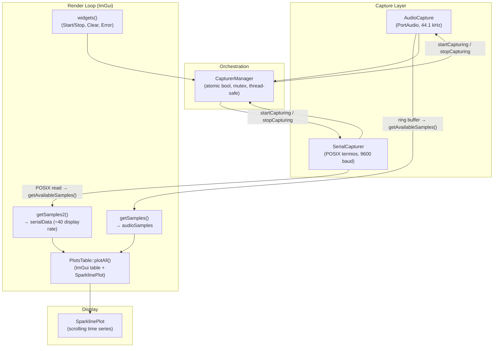
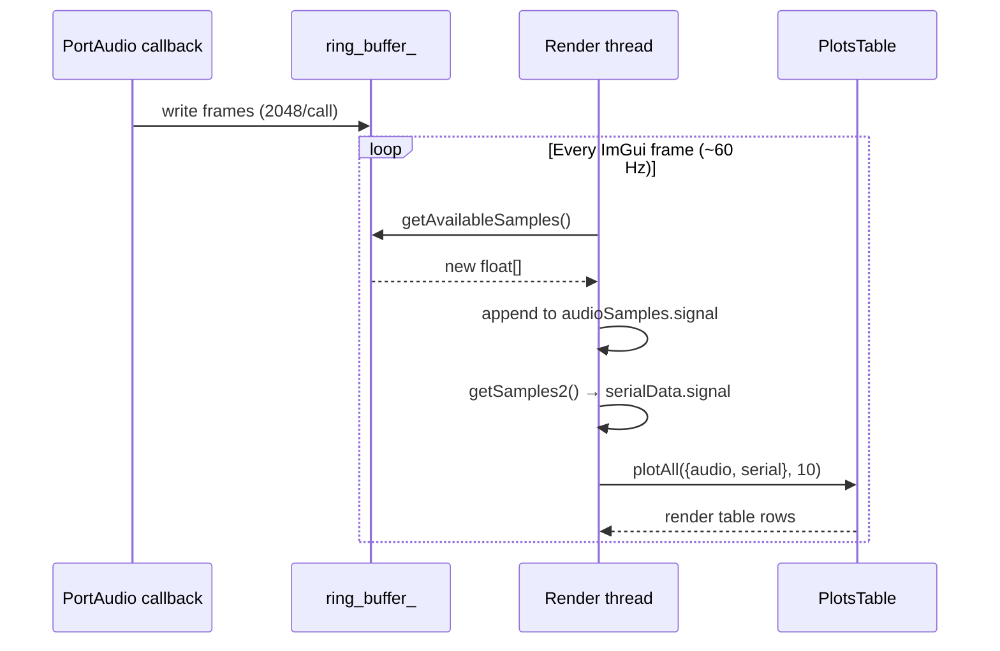

# SignalAcquirer — Real-Time Audio and Serial EEG Capture

Standalone GUI tool for simultaneous real-time audio capture (microphone, 44.1 kHz) and serial EEG device capture (9600 baud). Displays scrolling waveforms via ImGui/ImPlot. Used to acquire raw biometric data for the thesis pipeline before offline processing in the `nn` framework.

Source: `software/signalAquirer/`

---

## Theoretical Background

Simultaneous multimodal capture requires two asynchronous I/O channels — audio via a PortAudio callback and serial bytes via POSIX `read()` — merged into a single display loop without blocking the render thread. The standard pattern is a **producer-consumer ring buffer** [Knuth, 1997]: the audio callback writes into a power-of-two circular buffer at interrupt rate; the render loop reads available samples each frame.

For serial EEG devices (e.g., Arduino-based acquisition boards at 9600 baud), the raw byte rate is 9600 / 8 ≈ 1200 samples/s. To render serial and audio on the same time axis, serial data is **downsampled 40×** on the display path, yielding an effective display rate of `44100 / 40 ≈ 1103 Hz` — comparable to the EEG device rate [Teplan, 2002].

---

## Architecture



---

## Key Classes

### `ICapturer` (`lib/util/ICapturer.hpp`)

Abstract capture interface. All capturers implement:

```cpp
// lib/util/ICapturer.hpp
class ICapturer {
public:
    virtual bool start() = 0;
    virtual void stop() = 0;
    virtual bool isCapturing() const = 0;
    virtual const std::string& last_error() const = 0;
    virtual const std::vector<float> getAvailableSamples() = 0;
};
```

### `AudioCapture` (`lib/util/AudioCapture.hpp/cpp`)

PortAudio-backed ring buffer. Key constants:

| Constant | Value |
|---|---|
| `SAMPLE_RATE` | 44100 Hz |
| `FRAMES_PER_BUFFER` | 2048 |
| `NUM_CHANNELS` | 1 (mono) |
| Default ring buffer | 220,500 samples (5 s) |

Ring buffer uses power-of-two mask for lock-free index wrapping. The static PortAudio callback `static_audio_callback()` writes into `ring_buffer_` via `handle_audio_data()`. `getAvailableSamples()` drains available samples between `read_pos_` and `write_pos_`.

### `SerialCapturer` (`lib/util/SerialCapturer.hpp`)

Opens `/dev/ttyACM0` with POSIX `open()` + `termios` config: 8N1, no parity, baud rate set via `cfsetispeed/cfsetospeed`. `getAvailableSamples()` calls `read(fd, buffer, 255)` and parses one float per call via `std::stof`. **No framing protocol** — expects device to send ASCII float values terminated by `\0`.

### `CapturerManager` (`lib/util/CapturerManager.hpp/cpp`)

Holds a `vector<shared_ptr<ICapturer>>`. `startCapturing()` calls `start()` on all registered capturers; `stopCapturing()` calls `stop()` on all. `atomic<bool> capturing` and `mutex error_mutex` make it safe to toggle from the ImGui thread.

### `PlotsTable` / `SparklinePlot` (`lib/util/PlotsTable.hpp`, `lib/util/SparklinePlot.hpp`)

`PlotsTable::plotAll()` renders an `ImGui::BeginTable` with two columns: signal name + sparkline. Each row calls `SparklinePlot::Render()` passing the accumulated `Signal::signal` vector and sample rate. `TIMELINE_SIZE = 10` seconds of history shown.

---

## Data Flow



Serial display rate: `serialData.sampleRate = 44100 / 40 = 1102.5` — set in `getSamples2()`, not from the device.

---

## Building

```bash
cd software/signalAquirer
cmake --preset default   # or check Flags.cmake / Main.cmake for available presets
cmake --build . -j$(nproc)
```

Dependencies (checked by `PackageChecking.cmake`):

| Library | Role |
|---|---|
| PortAudio | Audio I/O callback |
| ImGui | Immediate-mode GUI |
| ImPlot | Plot widgets |
| Raylib | (linked, unused in main path) |
| POSIX termios | Serial port config |

---

## Usage Example

```bash
# Connect EEG device to /dev/ttyACM0 before launch
./signalAquirer

# GUI controls:
#   "Start Capture" — opens audio stream + serial port, begins ring-buffer fill
#   "Não plotando" / "Plotando" — toggle waveform rendering (decouple capture from display)
#   "Clear Display" — wipe audioSamples + serialData vectors
#   Red "Error:" label — appears if audio stream or serial open fails
```

To change the serial device path, edit `src/main.cpp:23`:
```cpp
shared_ptr<ICapturer> serialCapturer = make_shared<SerialCapturer>("/dev/ttyACM0", B9600);
```

---

## Common Pitfalls

1. **Serial device not present** — `SerialCapturer::start()` calls `open("/dev/ttyACM0", ...)`. If the device is absent, `fd == -1` and `lastError = "Failed to open serial port"`. `CapturerManager::startCapturing()` continues with audio only but does not surface per-capturer errors clearly — check the red error label and also `getErrors()`.

2. **Static `samples` vector in `getAvailableSamples()`** — `SerialCapturer::getAvailableSamples()` uses `static std::vector<float> samples` that accumulates across calls. It never shrinks. Long sessions will exhaust memory unless "Clear Display" is periodically pressed (which clears `serialData.signal` in `main.cpp` but not the static inside `SerialCapturer`). This is a known design limitation.

3. **Serial display rate mismatch** — `getSamples2()` hard-codes `serialData.sampleRate = AudioCapture::SAMPLE_RATE / 40`. If the attached EEG device runs at a different rate, the time axis in SparklinePlot will be incorrect. Match the divisor to the actual device sample rate.

4. **Ring buffer not power-of-two** — `AudioCapture` computes `ring_buffer_mask_ = ring_buffer_size_ - 1` for bitwise wrap. Default `44100 * 5 = 220500` is not a power of two, so the mask is incorrect and may cause read/write position aliasing at buffer boundaries. Use a true power-of-two size (e.g., `262144`) for safety.

---

## See Also

- [Research-Context](../Research-Context.md) — thesis pipeline; SignalAcquirer provides raw data before offline nn processing
- [Core/Wave](../Core/Wave.md) — WAV I/O used to save captured audio for offline feature extraction
- [Concepts/Imagined-Speech-and-EEG](../Concepts/Imagined-Speech-and-EEG.md) — motivation for simultaneous audio + EEG capture
- [Notebooks](../Notebooks.md) — Python notebooks that process audio captured by this tool

---

## References

[Knuth, 1997] D. E. Knuth, *The Art of Computer Programming, Vol. 2: Seminumerical Algorithms*, 3rd ed. Reading, MA: Addison-Wesley, 1997, §4.2.

[Teplan, 2002] M. Teplan, "Fundamentals of EEG measurement," *Measurement Science Review*, vol. 2, sec. 2, pp. 1–11, 2002.
